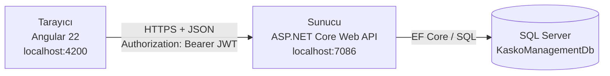
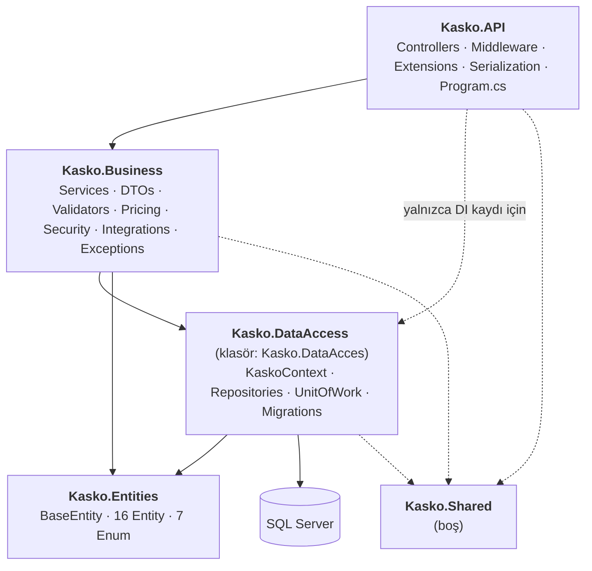
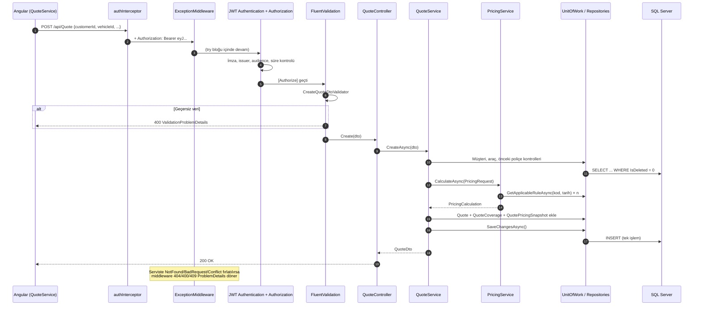

# 02 — Mimari

[← 01 Proje Tanıtımı](01-Proje-Tanitimi.md) · [Ana sayfa](README.md) · Sonraki: [03 — Veritabanı →](03-Veritabani.md)

---

## 1. Genel görünüm

Sistem üç ayrı programdan oluşur. Birbirleriyle yalnızca ağ üzerinden konuşurlar:



| Parça | Görevi | Güvenilir mi? |
|---|---|---|
| **Angular** | Ekranı çizer, kullanıcı etkileşimini API isteğine çevirir | **Hayır.** Kod kullanıcının tarayıcısında çalışır, değiştirilebilir. İş kuralı içermemelidir. |
| **Web API** | Kimlik doğrular, yetki kontrol eder, iş kurallarını uygular, hesaplar, kaydeder | Evet — güven sınırı burasıdır |
| **SQL Server** | Veriyi saklar; benzersizlik ve ilişki bütünlüğünü son savunma hattı olarak korur | Evet |

## 2. Katmanlı (N-Tier) mimari

Backend beş katmana ayrılmıştır. Oklar "bağımlıdır / tanır" anlamındadır:



### Katmanların sorumlulukları

| Katman | Sorumluluğu | Yapmaması gereken |
|---|---|---|
| **Kasko.API** | HTTP isteklerini karşılamak, rota ve yetki öznitelikleri (`[Authorize]`), hata biçimlendirme, Swagger, JSON ayarları, bağımlılıkların kaydı | İş kuralı içermek, `DbContext`'e doğrudan erişmek |
| **Kasko.Business** | İş kuralları, doğrulama, DTO ↔ entity dönüşümü, fiyat hesaplama, JWT üretimi, dış sistem entegrasyonları (demo) | HTTP'yi bilmek, SQL yazmak |
| **Kasko.DataAccess** | EF Core `DbContext`, tablo eşlemeleri, indeksler, repository'ler, transaction, migration'lar | İş kuralı bilmek |
| **Kasko.Entities** | Saf veri sınıfları ve enum'lar | Hiçbir projeye bağımlı olmamak — `Kasko.Entities.csproj` hiçbir referans içermez |
| **Kasko.Shared** | Ortak sabitler/yardımcılar için ayrılmış | Şu an **hiç kaynak dosyası yok**; üç proje referans verse de kullanılmıyor |

### Proje referansları (gerçek `.csproj` içerikleri)

| Proje | Referans verdiği projeler |
|---|---|
| `Kasko.API` | Business, DataAccess, Entities, Shared |
| `Kasko.Business` | DataAccess, Entities, Shared |
| `Kasko.DataAccess` | Entities, Shared |
| `Kasko.Entities` | — |
| `Kasko.Shared` | — |
| `Kasko.Business.Tests` | Business, DataAccess, Entities |
| `Kasko.IntegrationTests` | API |

`Kasko.API`'nin DataAccess'e referansı, `Program.cs` içinde `KaskoContext` ve repository'leri DI konteynerine kaydetmek içindir (composition root). Controller'lar DataAccess tiplerini kullanmaz.

### Bu ayrımın somut faydası

- `PricingService`'i test etmek için web sunucusu veya veritabanı gerekmez; repository'ler Moq ile taklit edilir. 191 birim testinin saniyeler içinde çalışmasının sebebi budur.
- Bir kural (örneğin "plaka benzersiz olmalı") tek bir serviste yaşar; birden fazla yerde tekrarlanmaz.
- Fiyat kuralları, sağlayıcı entegrasyonları veya veritabanı teknolojisi değiştiğinde üst katmanlar etkilenmez.

## 3. Klasör yapısı

```
Backend/KaskoManagementSystem/
├── Kasko.API/
│   ├── Controllers/             15 controller (70 uç nokta)
│   ├── Extensions/              ApplicationBuilderExtensions (UseExceptionMiddleware)
│   ├── Middleware/              ExceptionMiddleware
│   ├── Serialization/           UtcDateTimeJsonConverter
│   ├── Properties/              launchSettings.json
│   ├── appsettings.json         Bağlantı dizesi, JWT (Key hariç), log ayarları
│   └── Program.cs               DI kayıtları + HTTP pipeline
│
├── Kasko.Business/
│   ├── DTOs/                    Modül başına klasör (Auth, Customer, Vehicle, Quote, Policy, QuickQuote, ...)
│   ├── Exceptions/              NotFoundException, BadRequestException, ConflictException
│   ├── Integrations/
│   │   ├── Insurer/             IInsurerQuoteProvider + Demo A/B/C sağlayıcılar + karşılaştırma servisi
│   │   └── VehicleValue/        TSB Excel içe aktarma servisi
│   ├── Interfaces/              Servis arayüzleri
│   ├── Pricing/                 PricingService, PricingRequest, PricingCalculation
│   ├── Security/                JwtTokenService, PasswordHasherService
│   ├── Services/                İş servisleri + TurkishPlateNumber, VehicleCategoryClassifier,
│   │                            VehicleTechnicalSpecificationParser (yardımcı statik sınıflar)
│   └── Validators/              17 FluentValidation doğrulayıcısı (biri DTOs/PreviousPolicy altında)
│
├── Kasko.DataAcces/
│   ├── KaskoContext.cs          DbContext: 16 DbSet, tüm eşlemeler, global soft-delete filtresi, seed
│   ├── Migrations/              34 migration + model snapshot
│   └── Repositories/
│       ├── Abstract/            IGenericRepository<T>, IUnitOfWork, özel repository arayüzleri
│       └── Concrete/            GenericRepository<T>, UnitOfWork, özel repository'ler
│
├── Kasko.Entities/
│   ├── Abstract/BaseEntity.cs
│   ├── Concrete/                16 entity
│   └── Enums/                   7 enum
│
├── Kasko.Business.Tests/Services/    13 birim test sınıfı
└── Kasko.IntegrationTests/           17 entegrasyon test sınıfı + IntegrationTestHelper
```

## 4. Bir isteğin yaşam döngüsü

Örnek: yetkili bir kullanıcının `POST /api/Quote` ile teklif oluşturması.



## 5. HTTP pipeline (middleware sırası)

`Program.cs` içindeki sıralama birebir şudur:

```
1. UseSwagger / UseSwaggerUI        (yalnızca Development ortamında)
2. UseExceptionMiddleware           altındaki her şeyin hatasını yakalar
3. UseHttpsRedirection
4. UseCors("LocalDevelopment")      http(s)://localhost:4200
5. UseAuthentication                JWT'yi okur, kullanıcıyı tanır
6. UseAuthorization                 [Authorize] özniteliklerini uygular
7. MapHealthChecks("/health")
8. MapControllers
```

Sıralamanın sonuçları:

- `ExceptionMiddleware` en dışta olduğu için controller, servis ve repository'lerde fırlatılan tüm hatalar tek yerde biçimlendirilir.
- `ExceptionMiddleware`, `UseCors`'tan **önce** geldiği için bir 500 yanıtı CORS başlığı taşımaz; tarayıcı bunu gerçek hata yerine "CORS hatası" olarak gösterebilir.

## 6. Bağımlılık enjeksiyonu (DI)

Sınıflar bağımlılıklarını `new` ile oluşturmaz; constructor'da arayüz olarak ister. Hangi arayüze hangi sınıfın verileceği `Program.cs`'te bir kez tanımlanır. Tüm kayıtlar **Scoped** ömürlüdür (her HTTP isteği için bir örnek).

| Grup | Kayıtlar |
|---|---|
| DbContext | `KaskoContext` → SQL Server (`ConnectionStrings:DefaultConnection`) |
| Repository | `IUserRepository`, `IRoleRepository`, `ICustomerRepository`, `IVehicleRepository`, `IQuoteRepository`, `IPolicyRepository`, `IPaymentRepository`, `ICoverageRepository`, `IVehicleValueCatalogRepository`, `IPricingRuleRepository`, `IQuoteCoverageRepository`, `IInsurancePackageRepository`, `IPackageCoverageRepository`, `IPreviousPolicyRepository`, `IPricingRuleChangeRequestRepository`, açık jenerik `IGenericRepository<>` |
| Unit of Work | `IUnitOfWork` → `UnitOfWork` |
| Servis | `IUserService`, `IRoleService`, `IAuthService`, `ICustomerService`, `IVehicleService`, `IQuoteService`, `IPolicyService`, `IPaymentService`, `ICoverageService`, `IVehicleValueImportService`, `IVehicleValueCatalogService` (**iki kez kayıtlı**), `IPricingService`, `IPreviousPolicyService`, `IInsurancePackageService`, `IPricingRuleService`, `IPricingRuleChangeRequestService` |
| Entegrasyon | `InsurerQuoteComparisonService` (somut) + `IInsurerQuoteProvider` için **üç ayrı kayıt**: Demo A, B, C |
| Güvenlik | `IPasswordHasher<User>` → `PasswordHasher<User>`, `PasswordHasherService` (somut), `JwtTokenService` (somut) |
| Diğer | `AddHttpContextAccessor`, `AddHealthChecks`, `AddCors`, FluentValidation otomatik doğrulama, Swagger |

Aynı arayüz (`IInsurerQuoteProvider`) için birden fazla kayıt yapıldığında, `IEnumerable<IInsurerQuoteProvider>` isteyen sınıf **hepsini** alır. `InsurerQuoteComparisonService` bu sayede sağlayıcı sayısını bilmeden hepsini dolaşır; yeni sağlayıcı eklemek tek satırlık bir kayıttır.

## 7. Kullanılan tasarım desenleri

| Desen | Nerede | Neden |
|---|---|---|
| **Katmanlı mimari** | Tüm çözüm | Sorumlulukların ayrılması, test edilebilirlik |
| **Generic Repository** | `GenericRepository<T>` | 16 entity için CRUD kodunu bir kez yazmak |
| **Özel Repository** | `VehicleRepository`, `PricingRuleRepository`, `VehicleValueCatalogRepository`... | Entity'ye özgü sorgular (`PlateExistsAsync`, `GetApplicableRuleAsync`) |
| **Unit of Work** | `UnitOfWork` | Birden fazla tabloya yazmayı tek kayıtta/işlemde toplamak |
| **DTO** | `Kasko.Business/DTOs` | Entity'lerin (ör. `PasswordHash`) dışarı sızmaması, ekran başına veri şekli |
| **Dependency Injection** | `Program.cs` | Gevşek bağlılık (loose coupling), mock ile test |
| **Global Query Filter** | `KaskoContext.ApplySoftDeleteQueryFilters` | Soft delete'in unutulamaz olması |
| **Optimistic Concurrency** | `Policy.RowVersion` | Eş zamanlı güncellemenin sessizce ezilmemesi |
| **Snapshot** | `QuotePricingSnapshot` | Fiyat kuralı değişse bile eski teklifin fiyatının donması |
| **Temporal Versioning** | `PricingRule.Version/EffectiveFrom/EffectiveUntil` | Kuralın geçmiş değerlerini korumak |
| **Maker-Checker** | `PricingRuleChangeRequest` | Fiyat değişikliğinin iki kişi onayıyla yapılması |
| **Strategy** | `IInsurerQuoteProvider` + Demo A/B/C | Değiştirilebilir sigorta şirketi sağlayıcıları |
| **Middleware** | `ExceptionMiddleware` | Merkezî hata yönetimi |
| **Durum makinesi** | `QuoteService.ChangeStatusAsync`, `PolicyService` | Geçersiz durum geçişlerini engellemek |

## 8. Çapraz kesen konular

### 8.1 Hata yönetimi

Servisler iş kuralı ihlalinde üç özel istisnadan birini fırlatır; `ExceptionMiddleware` bunları HTTP koduna çevirir:

| İstisna | HTTP | Anlamı | Log seviyesi |
|---|---|---|---|
| `NotFoundException` | 404 | Kayıt yok (veya kullanıcının görmeye yetkisi yok) | Warning |
| `BadRequestException` | 400 | İş kuralı ihlali | Warning |
| `ConflictException` | 409 | Eş zamanlılık çakışması | Warning |
| Diğer tüm istisnalar | 500 | Beklenmeyen hata; gerçek mesaj **istemciye gönderilmez** | Error |

Yanıt `application/problem+json` biçimindedir; ayrıntı ve örnekler için [05-API-Referansi.md](05-API-Referansi.md#2-hata-formatı).

### 8.2 Doğrulama

`AddFluentValidationAutoValidation()` sayesinde geçersiz bir DTO controller'a **hiç ulaşmaz**; ASP.NET Core otomatik olarak 400 döndürür. İş kuralı gerektiren kontroller (benzersizlik, sahiplik, durum) ise serviste yapılır.

### 8.3 Tarih ve saat

Tüm tarihler UTC'dir. `UtcDateTimeJsonConverter` gelen JSON tarihlerini şu kurala göre UTC'ye çevirir:

| Gelen değer | Yorum |
|---|---|
| `2026-09-13T10:00:00Z` | UTC olarak alınır |
| `2026-09-13T13:00:00+03:00` | Ofsetten UTC'ye çevrilir (`10:00Z`) |
| `2026-09-13T10:00:00` (ofsetsiz) | **UTC kabul edilir** |
| Boş / geçersiz | `JsonException` → 400 |

Giden tüm `DateTime` değerleri UTC olarak yazılır. Sunucu tarafında `DateTime.UtcNow` kullanılır.

### 8.4 Soft delete

Hiçbir iş kaydı fiziksel olarak silinmez. `DELETE` isteği `IsDeleted = true`, `DeletedDate` ve (bazı modüllerde) `DeletedBy` alanlarını yazar. Ayrıntı: [03-Veritabani.md](03-Veritabani.md#4-soft-delete).

### 8.5 Sağlık kontrolü

`GET /health` uygulama ayaktaysa `200 Healthy` döner. Veritabanı bağlantısı kontrol **edilmez** (yalnızca canlılık).

## 9. Frontend mimarisi (özet)

Angular 22, `bootstrapApplication` ile başlatılan, `NgModule` içermeyen %100 standalone bir uygulamadır.

```
src/app/
├── core/           guards (authGuard, roleGuard) · interceptors (authInterceptor) · services (AuthService, TokenStorageService) · models
├── features/       her modül için liste/detay/oluştur/düzenle bileşenleri ve servisi
│   ├── quick-quotes/   herkese açık hızlı teklif sihirbazı
│   └── layout/         giriş yapılmış ekranların kenar menü + üst çubuk kabuğu
├── app.routes.ts   tüm rotalar (lazy loading yok)
└── app.config.ts   provideRouter + provideHttpClient(withInterceptors([authInterceptor]))
```

Ayrıntı: [07-Frontend.md](07-Frontend.md).

---

[← 01 Proje Tanıtımı](01-Proje-Tanitimi.md) · [Ana sayfa](README.md) · Sonraki: [03 — Veritabanı →](03-Veritabani.md)
