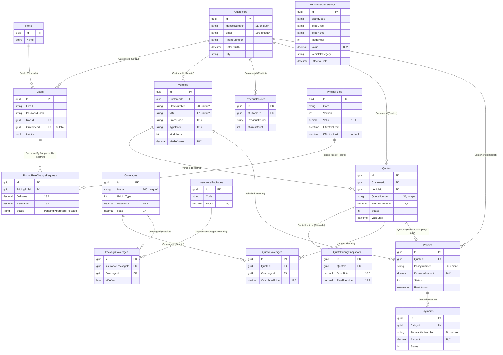

# 03 — Veritabanı

[← 02 Mimari](02-Mimari.md) · [Ana sayfa](README.md) · Sonraki: [04 — İş Kuralları →](04-Is-Kurallari.md)

---

## 1. Genel bilgiler

| Özellik | Değer |
|---|---|
| Veritabanı sistemi | Microsoft SQL Server |
| Geliştirme veritabanı adı | `KaskoManagementDb` (`Server=.;Trusted_Connection=True;TrustServerCertificate=True`) |
| ORM | Entity Framework Core 8.0.20 |
| Yaklaşım | **Code First** — önce C# entity sınıfları yazılır, tablolar migration ile üretilir |
| DbContext | `KaskoContext` (`Backend/KaskoManagementSystem/Kasko.DataAcces/KaskoContext.cs`) |
| Eşleme yöntemi | Tüm yapılandırma `OnModelCreating` içinde; ayrı `IEntityTypeConfiguration` sınıfı yok |
| Birincil anahtar | Tüm tablolarda `Id uniqueidentifier` (Guid) |
| Tablo sayısı | 16 iş tablosu + `__EFMigrationsHistory` |
| Migration sayısı | 34 |
| SQL betiği | Kök dizinde `database_schema.sql` — tüm migration'ların **idempotent** betiği (her adım `__EFMigrationsHistory` kontrolüyle çalışır, tekrar çalıştırılabilir) |

### Code First nasıl çalışır?

```
1. Entity sınıfı yazılır/değiştirilir          →  Kasko.Entities/Concrete/Vehicle.cs
2. KaskoContext'te eşleme tanımlanır            →  uzunluk, duyarlık, indeks, ilişki
3. Migration üretilir                           →  Add-Migration AddVehicle
4. Üretilen dosya incelenir                     →  Migrations/20260812120347_AddVehicle.cs
5. Veritabanına uygulanır                       →  Update-Database
6. SQL Server'da sonuç kontrol edilir           →  SSMS ile tablo/indeks sorgusu
```

## 2. ER diyagramı



`unique*` = yalnızca silinmemiş (`IsDeleted = 0`) kayıtlar arasında benzersiz (filtrelenmiş indeks). Diyagramda yer kazanmak için `BaseEntity` alanları gösterilmemiştir; hepsi her tabloda vardır.

## 3. Ortak alanlar — `BaseEntity`

Tüm entity'ler `Kasko.Entities/Abstract/BaseEntity.cs` sınıfından türer:

| Alan | Tip | Açıklama |
|---|---|---|
| `Id` | `Guid` | Birincil anahtar |
| `CreatedDate` | `DateTime` | Oluşturulma zamanı (UTC) |
| `UpdatedDate` | `DateTime?` | Son güncelleme |
| `IsDeleted` | `bool` | Soft delete işareti |
| `DeletedDate` | `DateTime?` | Silinme zamanı |
| `CreatedBy` | `string?` | Oluşturan (çoğu serviste doldurulmaz) |
| `UpdatedBy` | `string?` | Güncelleyen (çoğu serviste doldurulmaz) |
| `DeletedBy` | `Guid?` | Silen kullanıcı (`User`, `Customer`, `Vehicle`, `Policy`, `Payment` silmelerinde doldurulur) |

`KaskoContext` bu alanları otomatik doldurmaz (`SaveChanges` override'ı yoktur); değerleri servisler atar.

## 4. Soft delete

İş kayıtları fiziksel olarak silinmez. Bunu garanti eden iki mekanizma vardır:

**1. Silme = güncelleme.** `GenericRepository<T>.DeleteAsync` kaydı kaldırmak yerine `IsDeleted = true` ve `DeletedDate = DateTime.UtcNow` yazar. `UserRepository.DeleteUserAsync` ve `VehicleRepository.DeleteVehicleAsync` ayrıca `DeletedBy` alanını da doldurur.

**2. Global sorgu filtresi.** `KaskoContext.ApplySoftDeleteQueryFilters`, model oluşturulurken tüm entity tiplerini gezer ve `BaseEntity`'den türeyen her biri için çalışma zamanında şu filtreyi ekler:

```csharp
e => EF.Property<bool>(e, "IsDeleted") == false
```

Böylece `_dbSet.ToListAsync()` gibi her sorguya EF Core otomatik olarak `WHERE [IsDeleted] = 0` ekler. Yeni eklenen bir entity de otomatik korunur. Silinmiş kayda bilerek erişmek için `.IgnoreQueryFilters()` gerekir; bunu yalnızca `VehicleRepository.GetByIdIncludingDeletedAsync` yapar.

> **Dikkat:** Filtre, `Include` ile yüklenen zorunlu ilişkilere de uygulanır. Müşterisi soft-delete edilmiş bir teklif `GetByIdIncludingDetailsAsync` ile yüklendiğinde `quote.Customer` **null** gelir. `QuoteService.GetByIdAsync` bu alanı null kontrolü yapmadan kullandığı için böyle bir kayıtta 500 hatası oluşabilir (bkz. [11 — Bilinen sorunlar](11-Bilinen-Sorunlar-ve-Yol-Haritasi.md)).

## 5. Tablolar

### 5.1 `Roles`

| Kolon | Tip | Not |
|---|---|---|
| `Name` | nvarchar(max) | `Admin`, `Manager`, `Customer` (seed yok, elle oluşturulur) |

### 5.2 `Users`

| Kolon | Tip | Not |
|---|---|---|
| `FirstName`, `LastName`, `Email` | nvarchar(max) | E-posta benzersizliği serviste kontrol edilir; **veritabanında indeks yok** |
| `PasswordHash` | nvarchar(max) | ASP.NET Core Identity v3 formatı (PBKDF2) |
| `PhoneNumber` | nvarchar(max) null | |
| `IsActive` | bit | Pasif kullanıcı giriş yapamaz |
| `RoleId` | uniqueidentifier | → `Roles.Id`, **ON DELETE CASCADE** |
| `CustomerId` | uniqueidentifier null | → `Customers.Id`, **ON DELETE SET NULL**. `Customer` rolündeki kullanıcıyı müşteri kaydına bağlar (migration `AddUserCustomerRelation`, 03.09.2026) |

### 5.3 `Customers`

| Kolon | Tip | Kısıt |
|---|---|---|
| `FirstName`, `LastName` | nvarchar(25) | zorunlu |
| `IdentityNumber` | nvarchar(11) | zorunlu, **benzersiz (IsDeleted=0)** |
| `DateOfBirth` | datetime2 | sürücü yaşı hesabında kullanılır |
| `Email` | nvarchar(150) | zorunlu, **benzersiz (IsDeleted=0)** |
| `PhoneNumber` | nvarchar(15) | zorunlu |
| `Address` | nvarchar(100) | zorunlu |
| `City`, `District` | nvarchar(50) | zorunlu |
| `IsActive` | bit | |

### 5.4 `Vehicles`

| Kolon | Tip | Kısıt / Not |
|---|---|---|
| `CustomerId` | uniqueidentifier | → `Customers`, Restrict |
| `PlateNumber` | nvarchar(20) | zorunlu, **benzersiz (IsDeleted=0)**. Oluştururken normalize edilmiş hâlde saklanır (`34ABC123`); güncellemede normalize **edilmez** (bkz. bilinen sorunlar) |
| `VIN` | nvarchar(17) | zorunlu, **benzersiz (IsDeleted=0)** |
| `Brand`, `Model` | nvarchar(50) | zorunlu |
| `BrandCode`, `TypeCode` | nvarchar(max) null | TSB katalog anahtarı. Katalog entegrasyonundan önce oluşturulan eski kayıtlarda `NULL` |
| `ModelYear` | int | |
| `VehicleType`, `FuelType`, `TransmissionType` | int | enum |
| `EngineVolume` | decimal(4,2) null | |
| `EnginePower` | int null | |
| `Color` | nvarchar(30) | zorunlu |
| `MarketValue` | decimal(18,2) | **TSB kataloğundan** gelir, kullanıcıdan alınmaz |
| `IsActive` | bit | Pasif araç için teklif oluşturulamaz |

### 5.5 `VehicleValueCatalogs` (TSB kasko değer kataloğu)

| Kolon | Tip | Not |
|---|---|---|
| `BrandCode` | nvarchar(50) | TSB marka kodu |
| `TypeCode` | nvarchar(50) | TSB tip kodu |
| `BrandName` | nvarchar(100) | |
| `TypeName` | nvarchar(500) | Örn. `320d SEDAN 2.0 190 LUXURY PLUS` |
| `ModelYear` | int | |
| `Value` | decimal(18,2) | Kasko değeri (TL) |
| `Source` | nvarchar(50) | `TSB` |
| `EffectiveDate` | datetime2 | İçe aktarmada **sabit 01.08.2026** yazılır |
| `ImportedAt` | datetime2 | |
| `IsActive` | bit | |
| `VehicleCategory` | nvarchar(50) | `VehicleCategoryClassifier` ile `TypeName`'den türetilir (Sedan, SUV, Kamyonet, Motosiklet...) |

İndeksler:

| İndeks | Kolonlar | Benzersiz | Filtre | Amaç |
|---|---|---|---|---|
| (anahtar) | `BrandCode, TypeCode, ModelYear, EffectiveDate` | Evet | `IsDeleted = 0` | Tekrarlı kayıt engeli |
| `IX_VehicleValueCatalogs_ActiveBrands` | `BrandCode, BrandName` | Hayır | `IsDeleted = 0 AND IsActive = 1` | `/brands` sorgusunun hızı |
| `IX_VehicleValueCatalogs_ActiveTypes` | `BrandCode, TypeCode, TypeName` | Hayır | `IsDeleted = 0 AND IsActive = 1` | `/types` sorgusunun hızı |

### 5.6 `Coverages` (teminatlar)

| Kolon | Tip | Not |
|---|---|---|
| `Name` | nvarchar(100) | **benzersiz (IsDeleted=0)** |
| `Description` | nvarchar(500) null | |
| `PricingType` | int | `1 = Fixed` (sabit), `2 = PercentageOfVehicleValue` (araç değerinin yüzdesi). Kolonun varsayılanı `0`'dır; `0` enum'da yoktur ve fiyat hesabında hata verir |
| `BasePrice` | decimal(18,2) | Sabit fiyatlı teminatta tutar |
| `Rate` | decimal(9,4) null | Yüzdeli teminatta oran (örn. `0,5` = %0,5) |
| `DefaultLimit` | decimal(18,2) null | |
| `IsRequired`, `IsActive` | bit | |

### 5.7 `InsurancePackages` ve `PackageCoverages`

| `InsurancePackages` kolonu | Tip | Not |
|---|---|---|
| `Code` | nvarchar(50) | `EKONOMIK`, `STANDART`, `KAPSAMLI` (indeks yok) |
| `Name` | nvarchar(100) | |
| `Description` | nvarchar(500) null | |
| `Factor` | decimal(18,4) | Fiyat katsayısı (seed'de hepsi `1.0000`) |
| `IsActive` | bit | |

| `PackageCoverages` kolonu | Tip | Not |
|---|---|---|
| `InsurancePackageId` | uniqueidentifier | → `InsurancePackages`, Restrict |
| `CoverageId` | uniqueidentifier | → `Coverages`, Restrict |
| `IsDefault` | bit | `true` ise paket seçildiğinde teklife otomatik eklenir |

`(InsurancePackageId, CoverageId)` benzersizdir (**filtresiz**).

### 5.8 `Quotes` (teklifler)

| Kolon | Tip | Not |
|---|---|---|
| `CustomerId`, `VehicleId` | uniqueidentifier | Restrict |
| `QuoteNumber` | nvarchar(30) | **benzersiz (filtresiz)**. Biçim: `KLF-2026-` + 12 onaltılık karakter |
| `PremiumAmount` | decimal(18,2) | Fiyatlandırma motorunun `TotalPremium` sonucu |
| `Status` | int | `QuoteStatus` |
| `ValidUntil` | datetime2 | Geçerlilik bitişi |

### 5.9 `QuoteCoverages`

Teklife eklenen her teminatın **o anki** hesaplanmış fiyatı.

| Kolon | Tip | Not |
|---|---|---|
| `QuoteId`, `CoverageId` | uniqueidentifier | Restrict; `(QuoteId, CoverageId)` **benzersiz (IsDeleted=0)** |
| `CalculatedPrice` | decimal(18,2) | |
| `Limit` | decimal(18,2) null | Teminatın varsayılan limiti |

### 5.10 `QuotePricingSnapshots` (fiyat fotoğrafı)

Teklif başına **en fazla bir** kayıt (`QuoteId` benzersiz). `Quotes` silinirse **CASCADE** ile silinir.

| Kolon | Tip |
|---|---|
| `MarketValue`, `CoveragePremium`, `Discount`, `FinalPremium` | decimal(18,2) |
| `BaseRate`, `AgeFactor`, `UsageFactor`, `DriverFactor`, `ClaimsFactor`, `RegionFactor`, `PackageFactor`, `DeductibleFactor` | decimal(18,6) |

Neden var: [04 — İş Kuralları §8](04-Is-Kurallari.md#8-fiyat-kuralı-versiyonlama-ve-fiyat-fotoğrafı).

### 5.11 `Policies` (poliçeler)

| Kolon | Tip | Not |
|---|---|---|
| `CustomerId`, `VehicleId`, `QuoteId` | uniqueidentifier | Restrict |
| `PolicyNumber` | nvarchar(30) | **benzersiz (filtresiz)**. Biçim: `POL-2026-` + 8 karakter |
| `PremiumAmount` | decimal(18,2) | Tekliften kopyalanır |
| `StartDate`, `EndDate` | datetime2 | |
| `Status` | int | `PolicyStatus` |
| `RowVersion` | **rowversion** | Eş zamanlılık belirteci; SQL Server her güncellemede otomatik değiştirir |

`QuoteId` üzerinde **benzersiz (IsDeleted=0)** indeks vardır: bir tekliften yalnızca bir aktif poliçe üretilebilir.

### 5.12 `Payments` (ödemeler)

| Kolon | Tip | Not |
|---|---|---|
| `PolicyId` | uniqueidentifier | → `Policies`, Restrict |
| `TransactionNumber` | nvarchar(30) | **benzersiz (filtresiz)**. Biçim: `PAY-2026-` + 8 karakter |
| `Amount` | decimal(18,2) | Poliçenin `PremiumAmount` değeri |
| `Status` | int | `PaymentStatus` |
| `PaymentDate` | datetime2 null | Başarılı ödemede dolar |
| `FailureReason` | nvarchar(max) null | Başarısız ödemede *"Simüle edilen ödeme hatası."* |

### 5.13 `PreviousPolicies` (önceki poliçeler)

| Kolon | Tip | Not |
|---|---|---|
| `CustomerId` | uniqueidentifier | → `Customers`, Restrict |
| `PreviousInsurer` | nvarchar(max) | Önceki sigorta şirketi |
| `PolicyNumber` | nvarchar(max) | |
| `StartDate`, `EndDate` | datetime2 | |
| `ClaimsCount` | int | Hasar sayısı — fiyatlamada `CLAIMS_*` katsayısını belirler |

### 5.14 `PricingRules` (fiyat kuralları)

| Kolon | Tip | Not |
|---|---|---|
| `Code` | nvarchar(450) | Kural kodu (`BASE_KASKO_RATE`, `AGE_3_5`...) |
| `Name`, `Description` | nvarchar(max) | |
| `Value` | decimal(18,4) | Oran veya katsayı |
| `IsActive` | bit | |
| `Version` | int | Aynı kodun sürüm numarası |
| `EffectiveFrom` | datetime2 | Geçerlilik başlangıcı |
| `EffectiveUntil` | datetime2 null | Geçerlilik bitişi (`NULL` = açık uçlu) |

`(Code, Version)` **benzersiz (IsDeleted=0)**.

### 5.15 `PricingRuleChangeRequests` (fiyat değişiklik talepleri)

| Kolon | Tip | Not |
|---|---|---|
| `PricingRuleId` | uniqueidentifier | → `PricingRules`, Restrict |
| `OldValue`, `NewValue` | decimal(18,4) | |
| `Reason` | nvarchar(max) | Değişiklik gerekçesi |
| `RequestedBy` | uniqueidentifier | → `Users`, Restrict (talep eden Manager) |
| `RequestedDate` | datetime2 | |
| `ApprovedBy` | uniqueidentifier null | → `Users`, Restrict. **Reddetmede de** reddeden kullanıcı buraya yazılır |
| `ApprovedDate` | datetime2 null | Onay veya red zamanı |
| `Status` | nvarchar(max) | `"Pending"`, `"Approved"`, `"Rejected"` (enum değil, metin) |
| `EffectiveFrom` | datetime2 | Yeni sürümün başlayacağı tarih |

## 6. Enum'lar

Tüm enum'lar **1'den başlar**. Böylece atanmamış bir `int` (varsayılan `0`) yanlışlıkla geçerli bir duruma denk gelmez.

| Enum | Değerler |
|---|---|
| `QuoteStatus` | 1 Draft · 2 Offered · 3 Accepted · 4 Rejected · 5 Expired · 6 Cancelled |
| `PolicyStatus` | 1 Draft · 2 Active · 3 Expired · 4 Cancelled |
| `PaymentStatus` | 1 Pending · 2 Processing · 3 Successful · 4 Failed · 5 Cancelled · 6 Refunded |
| `CoveragePricingType` | 1 Fixed · 2 PercentageOfVehicleValue |
| `VehicleType` | 1 Sedan · 2 Hatchback · 3 SUV · 4 Pickup · 5 Coupe · 6 Convertible · 7 Van |
| `FuelType` | 1 Gasoline · 2 Diesel · 3 Hybrid · 4 Electric |
| `TransmissionType` | 1 Manual · 2 Automatic |

## 7. İndeks özeti

| Tablo | Kolon(lar) | Benzersiz | Soft-delete filtresi |
|---|---|---|---|
| Customers | IdentityNumber | ✔ | ✔ |
| Customers | Email | ✔ | ✔ |
| Vehicles | PlateNumber | ✔ | ✔ |
| Vehicles | VIN | ✔ | ✔ |
| Coverages | Name | ✔ | ✔ |
| Policies | QuoteId | ✔ | ✔ |
| QuoteCoverages | QuoteId, CoverageId | ✔ | ✔ |
| PricingRules | Code, Version | ✔ | ✔ |
| VehicleValueCatalogs | BrandCode, TypeCode, ModelYear, EffectiveDate | ✔ | ✔ |
| VehicleValueCatalogs | BrandCode, BrandName | — | ✔ + IsActive |
| VehicleValueCatalogs | BrandCode, TypeCode, TypeName | — | ✔ + IsActive |
| Quotes | QuoteNumber | ✔ | **✘** |
| Policies | PolicyNumber | ✔ | **✘** |
| Payments | TransactionNumber | ✔ | **✘** |
| PackageCoverages | InsurancePackageId, CoverageId | ✔ | **✘** |
| Users | Email | **indeks yok** | — |

**Filtrelenmiş benzersiz indeks neden gerekli?** Plaka `34ABC123` olan bir araç silinirse, aynı plakayla yeni araç eklenebilmelidir. Filtresiz bir benzersiz indeks silinmiş kaydı da sayar ve yeni eklemeyi engeller. `WHERE IsDeleted = 0` filtresi benzersizliği yalnızca aktif kayıtlar arasında uygular.

## 8. Eş zamanlılık (RowVersion)

`Policy.RowVersion` alanı `IsRowVersion().IsConcurrencyToken()` ile yapılandırılmıştır:

```
1. İstemci poliçeyi getirir     → yanıtta rowVersion = "AAAAAAAAB9E=" (Base64)
2. Başka biri poliçeyi günceller → SQL Server RowVersion'ı değiştirir
3. İstemci PUT gönderir          → { endDate, rowVersion: "AAAAAAAAB9E=" }
4. PolicyRepository.SetOriginalRowVersion ile EF'e eski sürüm bildirilir
5. UPDATE ... WHERE Id = @id AND RowVersion = @eski → 0 satır etkilenir
6. DbUpdateConcurrencyException → ConflictException → 409
```

## 9. Seed (başlangıç) verisi

### 9.1 Fiyat kuralları — 20 kayıt

`KaskoContext.OnModelCreating` içindeki `HasData` ile tanımlıdır (Id'ler `10000000-0000-0000-0000-0000000000NN`):

| Kod | Değer | Sürüm | Geçerlilik |
|---|---|---|---|
| `BASE_KASKO_RATE` | 0,0200 | 1 | 01.01.2026 – 31.08.2026 |
| `BASE_KASKO_RATE` | 0,0215 | 2 | 01.09.2026 – açık uçlu |
| `AGE_0_2` / `AGE_3_5` / `AGE_6_8` / `AGE_9_12` / `AGE_13_15` | 1,00 / 1,10 / 1,20 / 1,35 / 1,50 | 1 | 01.01.2026 – |
| `USAGE_PRIVATE` / `USAGE_COMMERCIAL` / `USAGE_RENTAL` | 1,00 / 1,25 / 1,40 | 1 | 01.01.2026 – |
| `DRIVER_25_PLUS` / `DRIVER_21_24` / `DRIVER_18_20` | 1,00 / 1,15 / 1,30 | 1 | 01.01.2026 – |
| `CLAIMS_0` / `CLAIMS_1` / `CLAIMS_2` / `CLAIMS_3_PLUS` | 0,90 / 1,00 / 1,15 / 1,30 | 1 | 01.01.2026 – |
| `REGION_LOW` / `REGION_NORMAL` / `REGION_HIGH` | 0,95 / 1,00 / 1,10 | 1 | 01.01.2026 – |

### 9.2 Sigorta paketleri — 3 kayıt (`SeedInsurancePackages`)

| Id | Kod | Ad | Factor |
|---|---|---|---|
| `11111111-1111-1111-1111-111111111111` | EKONOMIK | Ekonomik Paket | 1,0000 |
| `22222222-2222-2222-2222-222222222222` | STANDART | Standart Paket | 1,0000 |
| `33333333-3333-3333-3333-333333333333` | KAPSAMLI | Kapsamlı Paket | 1,0000 |

### 9.3 Paket teminatları — 8 kayıt (`SeedPackageCoverages`)

| Paket | Teminat Id'leri |
|---|---|
| EKONOMIK (2) | `dd1b1cc2-8b4f-43aa-8ed6-81bfe49200df`, `a0dd1498-c060-4547-8fa4-9d5cc54c9bf0` |
| STANDART (3) | yukarıdaki iki + `7733cfde-16a2-4329-b613-52a2f5cc8f1b` |
| KAPSAMLI (3) | yukarıdaki üçü |

> ⚠️ **Temiz kurulumda hata:** Bu üç `Coverages` kaydını **hiçbir migration eklemez**. Boş bir veritabanında `Update-Database`, `SeedPackageCoverages` adımında yabancı anahtar hatasıyla durur. Ayrıca `Roles` ve `Users` için hiç seed yoktur. Çözüm adımları: [09 — Kurulum Rehberi §4](09-Kurulum-Rehberi.md#4-veritabanını-oluşturma).

## 10. Migration tarihçesi

Migration zaman damgaları projenin geliştirme günlüğü gibi okunabilir.

| # | Migration | Tarih | Yaptığı değişiklik |
|---|---|---|---|
| 1 | `InitialCreate` | 05.08 | `Roles`, `Users` tabloları; `Users → Roles` Cascade |
| 2 | `FixDeletedByType` | 10.08 | `DeletedBy` metin → `uniqueidentifier` |
| 3 | `AddCustomer` | 12.08 | `Customer` tablosu |
| 4 | `AddVehicle` | 12.08 | `Vehicle` tablosu, `Customer`'a Restrict FK |
| 5 | `AddQuote` | 13.08 | Tablo adları çoğul yapıldı (`Customers`, `Vehicles`); `Quotes` tablosu |
| 6 | `AddPolicy` | 13.08 | `Policies` tablosu |
| 7 | `AddPayment` | 13.08 | `Payments` tablosu |
| 8 | `AddPaymentTransactionNumberUniqueIndex` | 14.08 | İşlem no benzersiz; FK Cascade → Restrict |
| 9 | `AddUniqueActivePolicyPerQuote` | 14.08 | Teklif başına tek aktif poliçe (filtreli) |
| 10 | `AddVehicleUniqueActiveIndexes` | 14.08 | Plaka ve VIN filtreli benzersiz |
| 11 | `AddCustomerUniqueActiveIndexes` | 14.08 | TC kimlik ve e-posta filtreli benzersiz |
| 12 | `AddPolicyRowVersion` | 17.08 | `Policies.RowVersion` (rowversion) |
| 13 | `AddCoverage` | 27.08 | `Coverages` tablosu |
| 14 | `AddCoveragePricingFields` | 27.08 | `PricingType`, `Rate`, `DefaultLimit`, `IsRequired` |
| 15 | `AddVehicleMarketValue` | 27.08 | `Vehicles.MarketValue` + `QuoteCoverages` tablosu |
| 16 | `AddVehicleValueCatalog` | 27.08 | `VehicleValueCatalogs` tablosu |
| 17 | `AddPricingRules` | 28.08 | `PricingRules` tablosu |
| 18 | `SeedPricingRules` | 28.08 | 19 fiyat kuralı |
| 19 | `AddVehicleTsbCodes` | 28.08 | `Vehicles.BrandCode`, `TypeCode` |
| 20 | `AddInsurancePackages` | 28.08 | `InsurancePackages`, `PackageCoverages` |
| 21 | `SeedInsurancePackages` | 28.08 | 3 paket |
| 22 | `SeedPackageCoverages` | 28.08 | 8 paket-teminat ilişkisi |
| 23 | `AddPreviousPolicy` | 31.08 | `PreviousPolicies` tablosu |
| 24 | `AddQuotePricingSnapshot` | 31.08 | `QuotePricingSnapshots` tablosu (QuoteId benzersiz, Cascade) |
| 25 | `AddPricingRuleVersioning` | 01.09 | `Version`, `EffectiveFrom`, `EffectiveUntil` |
| 26 | `AddPricingRuleVersionIndex` | 01.09 | `(Code, Version)` benzersiz |
| 27 | `SyncPricingRuleVersionSeed` | 01.09 | Seed kurallarına sürüm 1 ve başlangıç tarihi |
| 28 | `AddBaseKaskoRateVersion2` | 01.09 | v1 31.08.2026'da kapatıldı; v2 = 0,0215 eklendi |
| 29 | `AddPricingRuleChangeRequest` | 01.09 | `PricingRuleChangeRequests` tablosu |
| 30 | `FixPricingRuleChangeRequestPrecision` | 01.09 | `OldValue`/`NewValue` duyarlığı (18,2) → (18,4) |
| 31 | `AddUserCustomerRelation` | 03.09 | `Users.CustomerId` (SetNull) |
| 32 | `AddVehicleValueCatalogActiveBrandsIndex` | 07.09 | Marka listesi performans indeksi |
| 33 | `AddVehicleValueCatalogActiveTypesIndex` | 08.09 | Model listesi performans indeksi |
| 34 | `AddVehicleCategoryToVehicleValueCatalog` | 08.09 | `VehicleValueCatalogs.VehicleCategory` |

## 11. Faydalı SQL sorguları

```sql
-- Fiyat kuralları ve sürümleri
SELECT Code, Version, Value, EffectiveFrom, EffectiveUntil, IsActive, IsDeleted
FROM PricingRules
ORDER BY Code, Version;

-- Belirli bir tarihte geçerli temel oran
DECLARE @tarih datetime2 = '2026-09-15';
SELECT TOP 1 Code, Version, Value
FROM PricingRules
WHERE Code = 'BASE_KASKO_RATE' AND IsActive = 1 AND IsDeleted = 0
  AND EffectiveFrom <= @tarih
  AND (EffectiveUntil IS NULL OR EffectiveUntil >= @tarih)
ORDER BY Version DESC;

-- Bir teklifin fiyatının hangi parametrelerden oluştuğu
SELECT q.QuoteNumber, q.PremiumAmount, s.*
FROM Quotes q
JOIN QuotePricingSnapshots s ON s.QuoteId = q.Id
WHERE q.QuoteNumber = 'KLF-2026-XXXXXXXXXXXX';

-- Silinmiş ve aktif kayıtları birlikte görmek (soft delete kontrolü)
SELECT PlateNumber, IsDeleted, DeletedDate, DeletedBy FROM Vehicles ORDER BY IsDeleted, PlateNumber;

-- Durum dağılımları
SELECT Status, COUNT(*) FROM Quotes   WHERE IsDeleted = 0 GROUP BY Status;
SELECT Status, COUNT(*) FROM Policies WHERE IsDeleted = 0 GROUP BY Status;

-- TSB katalog özeti
SELECT COUNT(*) AS Toplam, COUNT(DISTINCT BrandCode) AS Marka, COUNT(DISTINCT TypeCode) AS Tip
FROM VehicleValueCatalogs WHERE IsDeleted = 0 AND IsActive = 1;
```

---

[← 02 Mimari](02-Mimari.md) · [Ana sayfa](README.md) · Sonraki: [04 — İş Kuralları →](04-Is-Kurallari.md)
