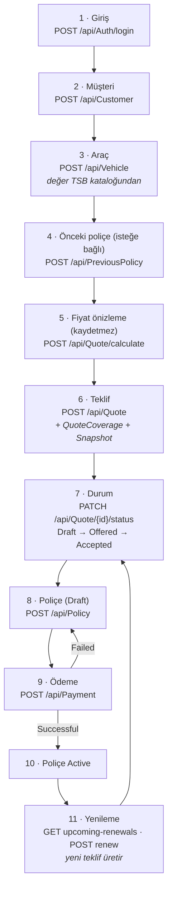
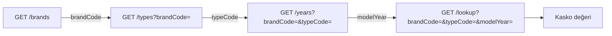
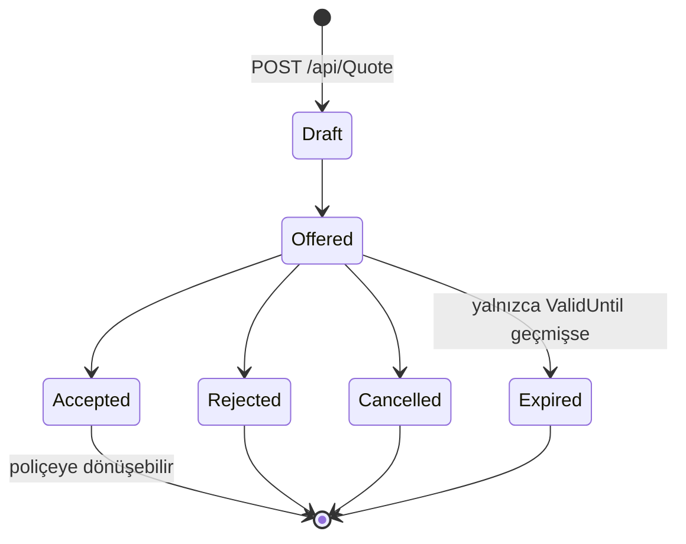
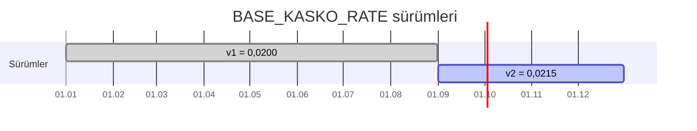
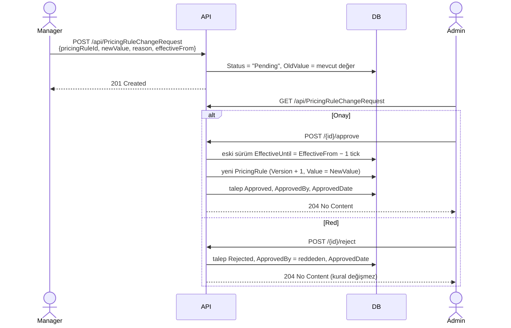
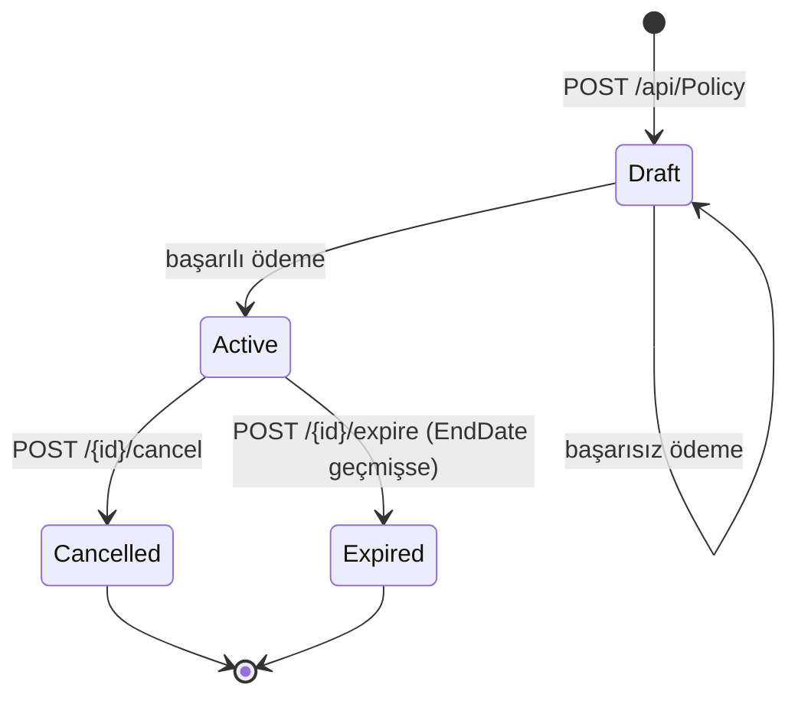

# 04 — İş Kuralları ve Akışlar

[← 03 Veritabanı](03-Veritabani.md) · [Ana sayfa](README.md) · Sonraki: [05 — API Referansı →](05-API-Referansi.md)

---

Bu belge sistemin **nasıl karar verdiğini** anlatır. Her kural, kaynak koddaki gerçek kontrol ve hata mesajıyla birlikte verilmiştir. Hata mesajları kullanıcıya aynen döner.

## 1. Uçtan uca satış akışı



Aynı akışın giriş yapmadan kullanılabilen kısa hâli **Hızlı Teklif**'tir (bkz. §12).

## 2. Müşteri (`CustomerService`)

### Doğrulama kuralları (`CreateCustomerDtoValidator`)

| Alan | Kural |
|---|---|
| `FirstName`, `LastName` | Zorunlu, en fazla 25 karakter |
| `IdentityNumber` | Zorunlu, tam **11 karakter**, yalnızca rakam |
| `DateOfBirth` | Zorunlu, bugünden önce |
| `Email` | Zorunlu, geçerli e-posta, en fazla 150 karakter |
| `PhoneNumber` | Zorunlu, en fazla 15 karakter, `^\+?[1-9]\d{1,14}$` (E.164 benzeri) |
| `Address` | Zorunlu, en fazla 100 karakter |
| `City`, `District` | Zorunlu, en fazla 50 karakter |

> Not: Güncellemede (`UpdateCustomerDtoValidator`) telefon için yalnızca uzunluk kontrolü vardır, format kontrolü yoktur.

### İş kuralları

| İşlem | Kural | Hata |
|---|---|---|
| Oluşturma | TC kimlik no başka müşteride olamaz | 400 *Bu TC Kimlik No ile kayıtlı bir müşteri zaten mevcut.* |
| Oluşturma | E-posta başka müşteride olamaz | 400 *Bu email adresi ile kayıtlı bir müşteri zaten mevcut.* |
| Güncelleme | Müşteri var olmalı | 404 *Müşteri bulunamadı.* |
| Güncelleme | TC / e-posta başka müşteride olamaz | 400 *Bu TC Kimlik No başka bir müşteri tarafından kullanılıyor.* |
| Silme | Soft delete; `DeletedBy` yazılır | 404 *Müşteri bulunamadı.* |

## 3. Araç (`VehicleService`)

### Doğrulama kuralları (`CreateVehicleDtoValidator`)

| Alan | Kural |
|---|---|
| `CustomerId` | Zorunlu |
| `PlateNumber` | Zorunlu, en fazla 20 karakter, **geçerli Türk plakası** (`TurkishPlateNumber.IsValid`) |
| `VIN` | Zorunlu, tam **17 karakter**, `^[A-HJ-NPR-Z0-9]+$` — uluslararası standart gereği `I`, `O`, `Q` harfleri yasak (1 ve 0 ile karışmasın diye) |
| `Brand`, `Model` | Zorunlu, en fazla 50 karakter |
| `BrandCode`, `TypeCode` | Zorunlu (TSB katalog anahtarı) |
| `ModelYear` | 1900 ile (bu yıl + 1) arasında |
| `VehicleType`, `FuelType`, `TransmissionType` | Geçerli enum değeri |
| `EngineVolume`, `EnginePower` | Verilmişse 0'dan büyük |
| `Color` | Zorunlu, en fazla 30 karakter |
| `MarketValue` | 0'dan büyük (ama sunucu bu değeri **kullanmaz**, bkz. aşağı) |

### Türk plaka kuralı (`TurkishPlateNumber`)

1. **Normalize:** Boşluk ve işaretler atılır, büyük harfe çevrilir → `" 34 abc 123 "` → `34ABC123`
2. **Uzunluk:** 5–10 karakter
3. **Desen:** `^(il kodu)(harf)(rakam)$`

| Parça | Kural | Örnek |
|---|---|---|
| İl kodu | `01`–`81` | `34` |
| Harf | 1–3 büyük harf | `ABC` |
| Rakam | 2–5 rakam | `123` |

Görüntüleme için `FormatForDisplay` → `34 ABC 123`.

### Oluşturma akışı

```
1. Müşteri var mı?                         yoksa → 404 Müşteri bulunamadı.
2. Plaka normalize edilir (34ABC123)
3. Plaka başka aktif araçta var mı?         varsa → 400 Bu plaka başka bir araç tarafından kullanılmaktadır.
4. VIN başka aktif araçta var mı?            varsa → 400 Bu VIN numarası başka bir araç tarafından kullanılmaktadır.
5. TSB kataloğunda (BrandCode, TypeCode, ModelYear) kaydı var mı?
                                            yoksa → 404 Seçilen marka, araç tipi ve model yılı için TSB araç değeri bulunamadı.
6. MarketValue = TSB kaydının Value değeri  ← istemcinin gönderdiği değer YOK SAYILIR
7. Kaydet
```

6. adım sistemin temel kuralının uygulandığı yerdir. `IntegrationTestHelper.CreateVehicleAsync` bunu doğrular: `MarketValue = 1` gönderir, yanıtta katalog değerini (`1.250.000`) bekler.

Güncelleme aynı kontrolleri yapar ve değeri yine katalogdan yeniden alır.

### Kaynak kontrolü

`Customer` rolündeki kullanıcı `GET /api/Vehicle/{id}` ile başka müşterinin aracını istediğinde **404** alır (varlığı gizlenir).

## 4. TSB araç değer kataloğu

### Neden var?

Araç değeri kullanıcıdan serbestçe alınsaydı fiyatlandırma anlamsızlaşırdı. Türkiye Sigorta Birliği her ay marka/tip/model yılı bazında kasko değer listesi yayımlar; sistem bu listeyi referans alır.

### İçe aktarma (`VehicleValueImportService`)

`POST /api/VehicleValueCatalog/import` (yalnızca Admin, `multipart/form-data`, yalnızca `.xlsx`).

Beklenen Excel yapısı:

| Kural | Değer |
|---|---|
| Sayfa adı | **`Smarka`** (büyük/küçük harf duyarsız) — yoksa hata |
| Başlık satırı | **2. satır**; 5. sütundan itibaren her sütun başlığı bir **model yılı** (`2026`, `2025`, ...) |
| Veri satırları | **3. satırdan** itibaren |
| 1. sütun | Marka kodu |
| 2. sütun | Tip kodu |
| 3. sütun | Marka adı |
| 4. sütun | Tip adı |
| 5+. sütunlar | O model yılının kasko değeri |

Her satır × her yıl sütunu bir katalog kaydına dönüşür:

| Durum | Sonuç sayacı |
|---|---|
| İlk 4 sütundan biri boş | `InvalidRowCount` |
| Değer sayı değil | `InvalidRowCount` |
| Değer ≤ 0 | `SkippedZeroValueCount` (atlanır) |
| Aynı (marka, tip, yıl, geçerlilik tarihi) zaten var | `DuplicateCount` (atlanır — **güncellenmez**) |
| Geçerli ve yeni | `ImportedCount` |

Her kayda `Source = "TSB"`, `EffectiveDate = 01.08.2026` (**kodda sabit**), `IsActive = true` ve `VehicleCategory` yazılır.

> ⚠️ Geçerlilik tarihi sabit olduğu için yeni ayın TSB listesi yüklendiğinde mevcut anahtarlar "tekrar" sayılır ve **yeni değerler içeri alınmaz**. Ayrıntı: [11 — Bilinen sorunlar](11-Bilinen-Sorunlar-ve-Yol-Haritasi.md).

Sonuç geliştirme ortamında **79.380 aktif kayıt** olarak doğrulanmıştır.

### Araç kategorisi (`VehicleCategoryClassifier`)

Tip adındaki anahtar kelimelere göre sırayla kontrol edilir; ilk eşleşme kazanır:

| Sıra | Anahtar kelimeler | Kategori |
|---|---|---|
| 1 | MOTOSIKLET, MOTORCYCLE, SCOOTER, ATV, QUAD | Motosiklet |
| 2 | MOTOKARAVAN, MOTORHOME | Motokaravan |
| 3 | MINIBUS, MIDIBUS | Minibus |
| 4 | OTOBUS, AUTOBUS | Otobus |
| 5 | CEKICI, TRACTOR HEAD | Cekici |
| 6 | KAMYONET, PANELVAN, PANEL VAN | Kamyonet |
| 7 | KAMYON, TRUCK | Kamyon |
| 8 | TRAKTOR, TRACTOR | Traktor |
| 9+ | SEDAN, HATCHBACK/HATCH, SUV, COUPE, CABRIO/CONVERTIBLE, PICKUP ... | ilgili kategori |
| — | eşleşme yok / boş | Diger |

`KAMYONET`'in `KAMYON`'dan, `CEKICI`'nin `TRAKTOR`'dan önce kontrol edilmesi bilinçlidir; aksi hâlde yanlış kategoriye düşerler.

### Kademeli seçim (cascade)



Tüm filtreleme, gruplama ve tekilleştirme **SQL Server tarafında** yapılır. İlk sürümde 79 bin kaydın tamamı belleğe alındığı için zaman aşımı yaşanmış; özel repository sorguları ve iki performans indeksi (`ActiveBrands`, `ActiveTypes`) ile çözülmüştür.

## 5. Önceki poliçe (`PreviousPolicyService`)

Müşterinin geçmişteki (başka şirketteki olabilir) poliçesi ve hasar sayısı kaydedilir.

| Kural | Kaynak |
|---|---|
| `PreviousInsurer` zorunlu, ≤ 200 karakter; `PolicyNumber` zorunlu, ≤ 100 | `PreviousPolicyDtoValidator` |
| `EndDate ≥ StartDate` | Validator |
| `ClaimsCount ≥ 0` (serviste de `ArgumentException`) | Validator + servis |
| Teklifte kullanılırken aynı müşteriye ait olmalı | `QuoteService` → 400 *Önceki poliçe bu müşteriye ait değil.* |

Teklifte `PreviousPolicyId` verilirse hasar sayısı **önceki poliçeden** alınır; istekteki `ClaimsCount` yok sayılır.

## 6. Teklif (`QuoteService`)

### Doğrulama (`CreateQuoteDtoValidator`)

| Alan | Kural |
|---|---|
| `CustomerId`, `VehicleId` | Zorunlu |
| `ValidUntil` | Şu andan sonra olmalı |
| `Usage` | `PRIVATE`, `COMMERCIAL`, `RENTAL` (büyük/küçük harf duyarsız) |
| `ClaimsCount`, `Deductible` | ≥ 0 |

### Oluşturma akışı (`CreateAsync`)

```
 1. ValidUntil geçmişte mi?                    → 400 Teklif geçerlilik tarihi gelecekte olmalıdır.
 2. Müşteri var mı?                            → 404 Müşteri bulunamadı.
 3. Araç var mı?                               → 404 Araç bulunamadı.
 4. Araç silinmiş mi?                          → 400 Silinmiş bir araç için teklif oluşturulamaz.
 5. Araç pasif mi?                             → 400 Pasif bir araç için teklif oluşturulamaz.
 6. Araç bu müşteriye mi ait?                  → 400 Seçilen araç bu müşteriye ait değildir.
 7. Teklif no üret: KLF-2026-XXXXXXXXXXXX
 8. Sürücü yaşı = müşterinin doğum tarihinden (bugüne göre)
 9. Bölge = "NORMAL"   ← şehirden türetilmiyor (bkz. §7.3)
10. Önceki poliçe verildiyse: var mı, bu müşterinin mi?
11. Teminatları çöz (ResolveCoverageIdsAsync):
      - Paket seçilmediyse: istenen teminatlar olduğu gibi
      - Paket seçildiyse: istenen her teminat pakette olmalı → 400
                          + paketteki IsDefault = true teminatlar otomatik eklenir
12. PricingService.CalculateAsync(...)
13. Quote            (Status = Draft, PremiumAmount = TotalPremium)
14. QuoteCoverage    (teminat başına bir satır, hesaplanmış fiyatla)
15. QuotePricingSnapshot (tüm katsayılar)
16. Tek SaveChangesAsync ile hepsi kaydedilir
```

`POST /api/Quote/calculate` aynı kontrolleri (1–12) çalıştırır ama **hiçbir şey kaydetmez**; müşteri fiyat görüp vazgeçerse veritabanında çöp teklif birikmez.

### Teklif durum makinesi



`ChangeStatusAsync` kuralları, uygulanma sırasıyla:

| # | Kural | Hata |
|---|---|---|
| 1 | Teklif var olmalı (Customer rolü için: kendi teklifi olmalı) | 404 *Teklif bulunamadı.* |
| 2 | Yeni durum mevcut durumla aynı olamaz | 400 *Teklif zaten bu durumdadır.* |
| 3 | `Accepted`, `Rejected`, `Expired`, `Cancelled` terminaldir | 400 *Bu durumdaki teklifin durumu değiştirilemez.* |
| 4 | `ValidUntil` geçmişse ve hedef `Expired` değilse → teklif **otomatik `Expired` yapılıp kaydedilir** ve hata döner | 400 *Teklifin geçerlilik süresi dolmuştur.* |
| 5 | Geçiş tabloda yoksa (ör. Draft → Accepted) | 400 *'Draft' durumundan 'Accepted' durumuna geçiş yapılamaz.* |
| 6 | Süresi dolmamış teklif `Expired` yapılamaz | 400 *Geçerlilik süresi dolmamış bir teklif Expired yapılamaz.* |

### Güncelleme ve silme

| İşlem | Kural |
|---|---|
| Güncelleme (`PUT`) | Yalnızca `ValidUntil` değişir. `Accepted` → 400 *Kabul edilmiş teklif güncellenemez.*; `Cancelled` → 400 *İptal edilmiş teklif güncellenemez.* |
| Silme | Soft delete |
| Customer rolü | Başkasının teklifinde getirme/güncelleme/silme/durum değiştirme → 404 |

## 7. Fiyatlandırma motoru (`PricingService`)

### 7.1 Formül

```
BasePremium          = MarketValue × BASE_KASKO_RATE
RiskAdjustedPremium  = BasePremium × AgeFactor × UsageFactor × ClaimsFactor
                                   × DriverFactor × RegionFactor × PackageFactor × DeductibleFactor
CoveragePremium      = Σ teminat fiyatları
TotalPremium         = RiskAdjustedPremium + CoveragePremium
```

- Ara adımlarda yuvarlama yapılmaz; `BasePremium`, `RiskAdjustedPremium`, `CoveragePremium` ve `TotalPremium` sonuçta `decimal.Round(x, 2)` ile yuvarlanır. Bu **banker yuvarlamasıdır** (`MidpointRounding.ToEven`): `…,125` → `…,12`.
- Teminat primleri risk katsayılarıyla **çarpılmaz**; risk primine düz olarak eklenir.
- **Hiçbir katsayı kodda yazılı değildir.** Değerler `PricingRules` tablosundan kural koduyla ve teklifin `EffectiveDate` tarihine göre okunur.

### 7.2 Hesaplama öncesi kontroller

| Kontrol | Hata |
|---|---|
| `MarketValue ≤ 0` | `ArgumentException` *Araç değeri 0'dan büyük olmalıdır.* |
| Paket + teminat verilmişse, her teminat pakete ait olmalı | `InvalidOperationException` *Seçilen teminatlardan biri seçilen pakete ait değil.* |
| Kural bulunamazsa | `InvalidOperationException` *Fiyatlandırma kuralı bulunamadı: {kod}* |

> Bu istisnalar `ExceptionMiddleware` tarafından tanınmaz ve **500** olarak döner.

### 7.3 Katsayıların seçimi

| Katsayı | Girdi | Seçim kuralı | Kural kodu → değer |
|---|---|---|---|
| **Temel oran** | Teklif tarihi | Tarihte geçerli en yüksek sürüm | `BASE_KASKO_RATE` → 0,0200 (v1) / 0,0215 (v2) |
| **Araç yaşı** | `bu yıl − ModelYear` (negatifse 0) | ≤2 · ≤5 · ≤8 · ≤12 · üstü | `AGE_0_2` 1,00 · `AGE_3_5` 1,10 · `AGE_6_8` 1,20 · `AGE_9_12` 1,35 · `AGE_13_15` 1,50 |
| **Kullanım** | `Usage` | boş → PRIVATE; tanımsız → hata | `USAGE_PRIVATE` 1,00 · `USAGE_COMMERCIAL` 1,25 · `USAGE_RENTAL` 1,40 |
| **Hasar** | Hasar sayısı | ≤0 · 1 · 2 · 3+ | `CLAIMS_0` **0,90** · `CLAIMS_1` 1,00 · `CLAIMS_2` 1,15 · `CLAIMS_3_PLUS` 1,30 |
| **Sürücü yaşı** | Doğum tarihinden | ≥25 veya ≤0 · 21–24 · 18–20 · 1–17 → hata | `DRIVER_25_PLUS` 1,00 · `DRIVER_21_24` 1,15 · `DRIVER_18_20` 1,30 |
| **Bölge** | `Region` | boş → NORMAL; tanımsız → hata | `REGION_LOW` 0,95 · `REGION_NORMAL` 1,00 · `REGION_HIGH` 1,10 |
| **Paket** | `PackageId` | Kural değil; paketin `Factor` alanı. Paket yoksa 1,00; pasif/silinmiş → hata | Seed'de hepsi 1,00 |
| **Muafiyet** | `Deductible` | Negatifse hata; aksi hâlde **her zaman 1,00** | — |

Dikkat edilecek noktalar:

- Araç yaşı `EffectiveDate`'ten değil **bugünün yılından** hesaplanır.
- `AGE_13_15`'in üst sınırı yoktur; 40 yaşındaki araç da 1,50 alır.
- `QuoteService` bölgeyi müşterinin şehrinden türetmez, her zaman `NORMAL` gönderir; bu yüzden `REGION_LOW` ve `REGION_HIGH` teklif akışında **kullanılmaz**.
- Muafiyet katsayısı için veritabanında kural yoktur; ticari değer uydurulmamış ve nötr bırakılmıştır.
- `Discount` ve `FinalPremium` alanları `PricingCalculation`'da vardır ama `PricingService` bunları **doldurmaz** (0 kalır). Snapshot'a `Discount = 0` ve `FinalPremium = TotalPremium` yazılır.

### 7.4 Teminat fiyatlaması

| `PricingType` | Formül | Örnek |
|---|---|---|
| `1` Fixed | `BasePrice` | Cam kırılması: 2.000 TL |
| `2` PercentageOfVehicleValue | `MarketValue × Rate / 100` | 1.250.000 TL araç, `Rate = 0,5` → 6.250 TL |

Kontroller: istenen teminatların hepsi bulunmalı ve aktif olmalı; yüzdeli teminatta `Rate` tanımlı olmalı; aksi hâlde `InvalidOperationException` (500).

### 7.5 Örnek hesaplama

**Girdi:** 2017 model araç, TSB değeri **1.250.000 TL**, 30 yaşında sürücü, hasarsız, özel kullanım, paket yok, tek teminat (sabit 2.000 TL), teklif tarihi 13.09.2026.

| Adım | Kural | Değer | Ara sonuç |
|---|---|---|---|
| Temel prim | `BASE_KASKO_RATE` v2 (01.09.2026 sonrası) | 0,0215 | 1.250.000 × 0,0215 = **26.875,00** |
| Araç yaşı 9 | `AGE_9_12` | 1,35 | 36.281,25 |
| Kullanım | `USAGE_PRIVATE` | 1,00 | 36.281,25 |
| Hasar 0 | `CLAIMS_0` | 0,90 | 32.653,125 |
| Sürücü 30 | `DRIVER_25_PLUS` | 1,00 | 32.653,125 |
| Bölge | `REGION_NORMAL` | 1,00 | 32.653,125 |
| Paket | — | 1,00 | 32.653,125 |
| Muafiyet | — | 1,00 | **RiskAdjustedPremium = 32.653,12** |
| Teminat | Fixed | 2.000,00 | **CoveragePremium = 2.000,00** |
| Toplam | 32.653,125 + 2.000 | | **TotalPremium = 34.653,12 TL** |

Aynı teklif 15.08.2026 tarihli olsaydı v1 (0,0200) kullanılır, temel prim 25.000,00 olurdu.

## 8. Fiyat kuralı versiyonlama ve fiyat fotoğrafı

### 8.1 Sorun: "Fiyat değişince eski teklifler ne olacak?"

15 Ağustos'ta 32.000 TL teklif verilir, 1 Eylül'de temel oran artırılır, müşteri 3 Eylül'de kabul eder. Fiyat yeniden hesaplanırsa müşteri farklı bir rakam görür — hem yanlış hem hukuken sorunludur.

**Çözüm — `QuotePricingSnapshot`:** Teklif oluşturulduğu anda hesapta kullanılan tüm değerler ayrı tabloya yazılır ve bir daha değişmez. `QuoteIntegrationTests.OldQuote_Should_Keep_OldPricingSnapshot_When_NewPricingRuleVersion_IsAdded` bu davranışı doğrular.

### 8.2 Sorun: "Aynı kural farklı tarihlerde farklı değer alabilir mi?"

Kural satırı `UPDATE` edilseydi geçmiş kaybolurdu. **Çözüm:** kural satırları sürümlenir.



Seçim sorgusu (`PricingRuleRepository.GetApplicableRuleAsync`):

```csharp
!IsDeleted && IsActive && Code == code
&& EffectiveFrom <= effectiveDate
&& (EffectiveUntil == null || EffectiveUntil >= effectiveDate)
→ OrderByDescending(Version).FirstOrDefault()
```

`PricingRequest.EffectiveDate` bütün katsayı okumalarına **aynı tarihi** taşır; bir teklif yarı v1 yarı v2 olamaz.

| Teklif tarihi | Seçilen | Oran |
|---|---|---|
| 15.08.2026 | v1 | 0,0200 |
| 31.08.2026 | v1 | 0,0200 |
| 01.09.2026 | v2 | 0,0215 |

### 8.3 Kural yönetimi (`PricingRuleService`)

| İşlem | Davranış |
|---|---|
| Oluşturma | Aynı koddaki en yüksek sürüm + 1. Aynı kodun açık uçlu önceki sürümleri `EffectiveUntil = yeni EffectiveFrom − 1 gün` ile kapatılır |
| Güncelleme | Aynı satırda `Name`, `Description`, `Value`, `IsActive` değişir — **yeni sürüm oluşturmaz** |
| Silme | Soft delete |

## 9. Fiyat değişiklik talebi — iki kişi kuralı (`PricingRuleChangeRequestService`)

Fiyat kuralını tek kişinin değiştirebilmesi riskli olduğu için **maker-checker** uygulanır: Manager önerir, Admin karar verir.



| İşlem | Kural | Hata (tip) |
|---|---|---|
| Oluşturma | Kural var ve silinmemiş olmalı | *Pricing rule bulunamadı.* (`KeyNotFoundException`) |
| Oluşturma | `NewValue ≥ 0` | *Yeni değer negatif olamaz.* (`ArgumentException`) |
| Oluşturma | `EffectiveFrom` gelecekte olmalı | *EffectiveFrom gelecekte bir tarih olmalıdır.* (`ArgumentException`) |
| Onay/Red | Talep var olmalı | *Change request bulunamadı.* (`KeyNotFoundException`) |
| Onay/Red | Yalnızca `Pending` talepler | *Sadece Pending durumundaki talepler onaylanabilir/reddedilebilir.* (`InvalidOperationException`) |
| Onay | Yeni başlangıç, mevcut sürümün başlangıcından sonra olmalı | *Yeni version mevcut versiondan daha ileri bir EffectiveFrom tarihine sahip olmalıdır.* |

> Bu servis özel istisnalar yerine .NET istisnaları kullandığı için yukarıdaki hatalar istemciye **500** olarak döner. Reddetme için ayrı `RejectedBy/RejectedDate` alanı yoktur; `ApprovedBy/ApprovedDate` kullanılır.

## 10. Poliçe (`PolicyService`)

### Oluşturma (`POST /api/Policy`)

| # | Kural | Hata |
|---|---|---|
| 1 | Müşteri var olmalı | 404 *Müşteri bulunamadı.* |
| 2 | Araç var olmalı ve müşteriye ait olmalı | 404 / 400 *Araç belirtilen müşteriye ait değildir.* |
| 3 | Teklif var olmalı, müşteriye ve araca ait olmalı | 404 / 400 |
| 4 | Teklifin süresi dolmamış olmalı | 400 *Teklifin geçerlilik süresi dolmuştur.* |
| 5 | Teklif **`Accepted`** olmalı | 400 *Sadece kabul edilmiş teklifler poliçeye dönüştürülebilir.* |
| 6 | `StartDate < EndDate` | 400 *Poliçe başlangıç tarihi bitiş tarihinden önce olmalıdır.* |
| 7 | Bu tekliften daha önce poliçe üretilmemiş olmalı | 400 *Bu teklif için zaten bir poliçe oluşturulmuştur.* (veritabanında da filtreli benzersiz indeks) |

Sonuç: `PolicyNumber = POL-2026-XXXXXXXX`, `PremiumAmount` tekliften kopyalanır, **`Status = Draft`**.

### Poliçe durum makinesi



| İşlem | Kural | Hata |
|---|---|---|
| Güncelleme (`PUT`) | Yalnızca `EndDate` değişir; `EndDate > StartDate` | 400 |
| Güncelleme | `Expired` / `Cancelled` poliçe güncellenemez | 400 *Süresi dolmuş veya iptal edilmiş poliçe güncellenemez.* |
| Güncelleme | `RowVersion` geçerli Base64 olmalı | 400 *Geçersiz RowVersion değeri.* |
| Güncelleme | Başkası araya güncelleme yaptıysa | **409** *Poliçe başka bir kullanıcı tarafından güncellenmiş. Lütfen güncel veriyi tekrar alın.* |
| İptal | Yalnızca `Active` | 400 *Sadece aktif poliçe iptal edilebilir.* |
| Süre dolumu | Yalnızca `Active` ve `EndDate` geçmiş | 400 *Poliçenin süresi henüz dolmamıştır.* |
| Customer rolü | Başkasının poliçesinde getirme/güncelleme/silme/yenileme | 404 |

### Yenileme

**Yaklaşan yenilemeler** — `GET /api/Policy/upcoming-renewals?daysAhead=30`: `Active` durumdaki ve bitiş tarihi bugün ile (bugün + `daysAhead`) arasında olan poliçeleri bitiş tarihine göre sıralı döner. `daysAhead < 1` → 400.

**Yenileme** — `POST /api/Policy/renew`:

```
1. Poliçe var mı, Active mi?               → 404 / 400 Sadece aktif poliçe yenilenebilir.
2. (Customer rolü) kendi poliçesi mi?      → 404
3. StartDate < EndDate                     → 400
4. StartDate ≥ mevcut poliçenin EndDate'i  → 400 Yenileme başlangıç tarihi mevcut poliçenin bitiş tarihinden önce olamaz.
5. QuoteService.CreateAsync(
       aynı müşteri, aynı araç,
       ValidUntil = yeni StartDate,
       Usage / ClaimsCount / PackageId / Deductible / CoverageIds = istekten,
       EffectiveDate = şimdi)
6. Yeni teklif (Draft) döner
```

Yenileme doğrudan poliçe üretmez; **güncel fiyat kurallarıyla yeni bir teklif** üretir. Teklif normal akışla (Offered → Accepted → Policy → Payment) ilerler. Aynı poliçe için birden fazla yenileme teklifi oluşturulması engellenmez.

## 11. Ödeme (`PaymentService`)

> Bu bir **demo ödemedir**. Gerçek bir ödeme sağlayıcısına bağlanmaz, para tahsil edilmez.

```
1. Poliçe var mı?                                  → 404 Poliçe bulunamadı.
2. Bu poliçeye daha önce başarılı ödeme yapılmış mı? → 400 Bu poliçe için zaten başarılı bir ödeme bulunmaktadır.
3. Poliçe zaten Active mi?                          → 400 Bu poliçe zaten aktiftir.
4. İşlem no üret: PAY-2026-XXXXXXXX (benzersiz olana kadar tekrar)
5. Durum = istekteki SimulateFailure ? Failed : Successful
6. Amount = poliçenin PremiumAmount'u     ← istemciden tutar alınmaz
7. Tek transaction içinde:
     - Payment kaydı eklenir
     - Successful ise Policy.Status = Active
```

| `SimulateFailure` | Payment | Poliçe |
|---|---|---|
| `false` | `Successful (3)`, `PaymentDate` dolu | `Active (2)` |
| `true` | `Failed (4)`, `FailureReason = "Simüle edilen ödeme hatası."` | `Draft (1)` kalır; tekrar ödeme denenebilir |

## 12. Hızlı Teklif (Quick Quote)

Giriş yapmamış bir ziyaretçinin TC kimlik no ve telefonla kendini doğrulayıp fiyat görebildiği akıştır. `QuickQuoteController` sınıf düzeyinde `[AllowAnonymous]`'dır.

### Müşteri doğrulama (`CustomerService.GetForQuickQuoteAsync`)

```
1. TC kimlik no ve telefondaki rakam dışı karakterler atılır
2. TC kimlik no ile müşteri aranır                  → yoksa Found = false
3. Telefonlar karşılaştırılır; 12 haneli ve "90" ile başlayan numara "0" ile başlayan 11 haneye çevrilir
   (+90 555 123 45 67  ≡  0555 123 45 67)          → eşleşmezse Found = false
4. Müşteri pasif veya silinmişse                    → Found = false
5. Found = true, CustomerId, FirstName, LastName
```

Hangi adımda başarısız olunduğu dışarıya söylenmez; hep aynı `Found = false` döner.

### Uç noktalar

| Uç nokta | Ne yapar |
|---|---|
| `POST /api/QuickQuote/customer/lookup` | Doğrulama sonucunu döner |
| `POST /api/QuickQuote/customer/vehicles` | Doğrulanan müşterinin **aktif** araçlarını döner |
| `GET /api/QuickQuote/packages` | Sigorta paketleri ve teminatları |
| `POST /api/QuickQuote/calculate` | Müşteriyi doğrular, `QuoteService.CalculateAsync` ile fiyat hesaplar (`ValidUntil = +7 gün`, `EffectiveDate = şimdi`). **Kaydetmez** |
| `POST /api/QuickQuote/compare` | Aynı talebi 3 demo sigorta şirketine fiyatlatıp sıralar |

### Arayüz sihirbazı (6 adım)

| Adım | Başlık | Çağrılan uç nokta |
|---|---|---|
| 1 | Teklif Alın | `customer/lookup` |
| 2 | Aracınızı Seçin | `customer/vehicles` |
| 3 | Risk Bilgileri | — (kullanım, hasar sayısı, muafiyet) |
| 4 | Kasko Paketinizi Seçin | `packages` |
| 5 | Teminatlarınızı Belirleyin | — |
| 6 | Kasko Teklifiniz Hazır | `calculate` → `totalPremium` gösterilir |

### Sigorta şirketi karşılaştırma (`InsurerQuoteComparisonService`)

**Strategy** deseniyle üç demo sağlayıcı aynı fiyatlandırma motorunu çağırıp kendi katsayılarını uygular:

| Sağlayıcı | Sınıf | Katsayı |
|---|---|---|
| Provider A | `DemoInsurerAQuoteProvider` | × 0,98 |
| Provider B | `DemoInsurerBQuoteProvider` | × 1,03 |
| Provider C | `DemoInsurerCQuoteProvider` | × 1,08 |

Sonuçlar `Premium` alanına göre artan sırada döner. Yeni bir sağlayıcı eklemek için `IInsurerQuoteProvider` uygulayan bir sınıf yazıp `Program.cs`'e kaydetmek yeterlidir.

Bilinen farklar ve sorunlar:

- `Premium` alanı `Calculation.FinalPremium`'dan okunur; `FinalPremium` hiç doldurulmadığı için üç sağlayıcının `Premium` değeri de **0** gelir ve sıralama anlamsızlaşır. `Calculation.TotalPremium` doğru ölçeklenir ama **yuvarlanmaz**. Canlı istekle doğrulanan yanıt: `Provider A → premium 0.0, totalPremium 32000.0576`; B → `33632.7136`; C → `35265.3696`.
- `compare`, `calculate`'ten farklı olarak `PricingRequest`'i kendisi kurar: **sürücü yaşı gönderilmez** (her zaman `DRIVER_25_PLUS`), paketin varsayılan teminatları eklenmez.
- Arayüz bu uç noktayı şu an **çağırmıyor** (`compareQuotes` servis metodu tanımlı ama kullanılmıyor).

## 13. Kullanıcı ve kimlik (`UserService`, `AuthService`)

| İşlem | Kural |
|---|---|
| Kullanıcı oluşturma | E-posta benzersiz (400 *Bu email adresi zaten kayıtlı.*); rol var olmalı (404); `CustomerId` verildiyse müşteri var olmalı (404 *Müşteri bulunamadı.*) |
| Parola kuralı | 6–20 karakter; en az bir küçük harf, bir büyük harf, bir rakam ve bir özel karakter (`@$!%*?&`) |
| Telefon | Verilmişse `^\+?[1-9]\d{1,14}$` |
| Rol adı (oluşturma) | 5–20 karakter |
| Giriş | E-posta yoksa 404 *Email veya şifre hatalı.*; pasif kullanıcı 400 *Kullanıcı aktif değil.*; parola yanlışsa 400 *Email veya şifre hatalı.* |

`Customer` rolündeki bir kullanıcının kendi verisine erişebilmesi için `CustomerId` alanının ilgili müşteri kaydına bağlanmış olması gerekir.

## 14. Kaynak bazlı yetkilendirme deseni

`Customer` rolündeki kullanıcının başkasının kaydına erişmesi şu desenle engellenir (`QuoteService`, `PolicyService`, `VehicleService` içinde tekrarlanır):

```csharp
if (httpContext.User.IsInRole("Customer"))
{
    var userId = User.FindFirst(ClaimTypes.NameIdentifier);   // token'dan
    var currentUser = await _unitOfWork.Users.GetByIdAsync(userId);

    if (currentUser?.CustomerId == null ||
        kayit.CustomerId != currentUser.CustomerId.Value)
    {
        throw new NotFoundException("... bulunamadı.");        // 403 değil 404
    }
}
```

**Neden 403 değil 404?** 403 "kayıt var ama sana yasak" demektir ve başka müşterilerin kayıtlarının varlığını ele verir. 404 varlığı gizler.

Hangi işlemlerde uygulandığı ve **uygulanmadığı** yerler için: [06 — Güvenlik §5](06-Guvenlik.md#5-kaynak-bazlı-yetkilendirme).

---

[← 03 Veritabanı](03-Veritabani.md) · [Ana sayfa](README.md) · Sonraki: [05 — API Referansı →](05-API-Referansi.md)
