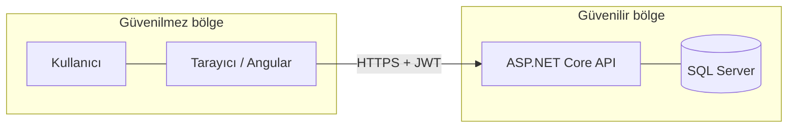
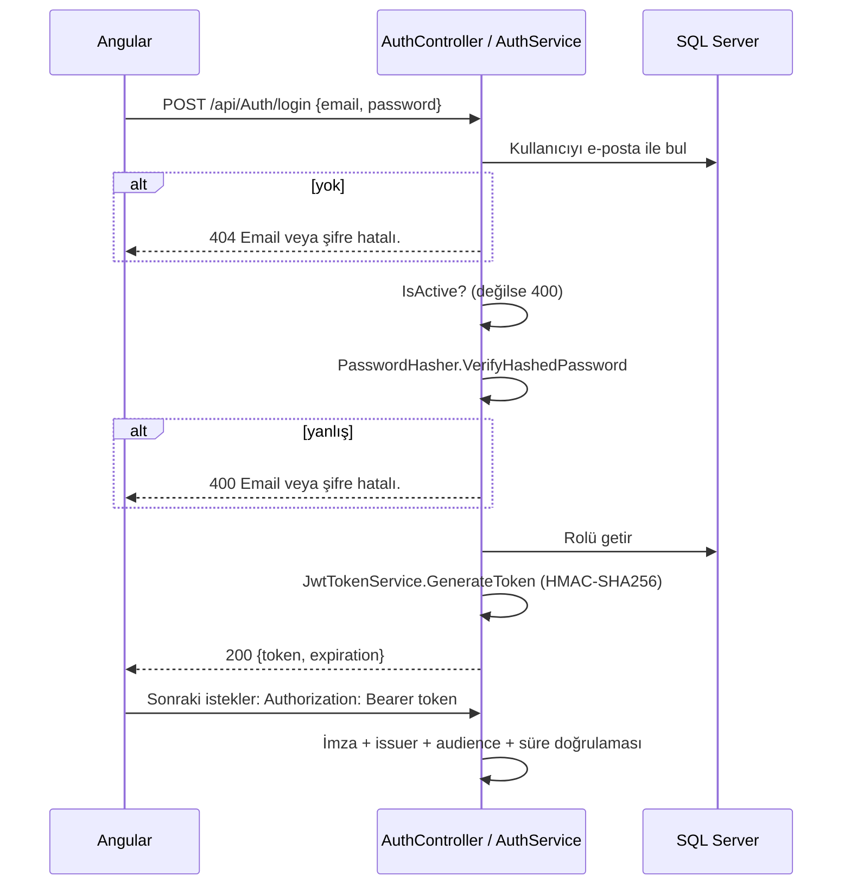

# 06 — Güvenlik

[← 05 API Referansı](05-API-Referansi.md) · [Ana sayfa](README.md) · Sonraki: [07 — Frontend →](07-Frontend.md)

---

Bu belge güvenlik mekanizmalarını **ve** kod incelemesinde bulunan açıkları birlikte anlatır. Açıklar mevcut kod durumunu (`676b33f`) yansıtır; çözüm önerileri [11 — Bilinen Sorunlar](11-Bilinen-Sorunlar-ve-Yol-Haritasi.md) belgesindedir.

## 1. Güven sınırı



Angular kodu kullanıcının bilgisayarında çalışır; geliştirici araçlarıyla değiştirilebilir, istekler elle üretilebilir. Bu yüzden:

- Frontend'deki rol kontrolleri yalnızca **kullanıcı deneyimi** içindir, güvenlik sağlamaz.
- Her yetki ve iş kuralı kontrolü **API'de** yapılmalıdır.
- İstemciden gelen fiyat, araç değeri ve ödeme tutarı kullanılmaz; sunucu yeniden türetir.

## 2. Kimlik doğrulama (JWT)

### 2.1 Akış



### 2.2 Token içeriği (`JwtTokenService`)

| Claim | Değer |
|---|---|
| `sub` | Kullanıcı Id |
| `email` | E-posta |
| `ClaimTypes.Name` | `"Ad Soyad"` |
| `ClaimTypes.Role` | **Rol adı** (`Admin`, `Manager`, `Customer`) |
| `ClaimTypes.NameIdentifier` | Kullanıcı Id (servislerde kaynak kontrolü için okunur) |

Rol **adının** token'a yazılması sayesinde `[Authorize(Roles = "Admin")]` her istekte veritabanına sorgu atmadan çalışır. Bedeli: bir kullanıcının rolü değiştirilirse eski token süresi dolana kadar eski rolle geçerli kalır.

Token'ın orta kısmı **şifreli değildir**, yalnızca Base64 kodludur; herkes okuyabilir. Güvenliği imza sağlar. Bu yüzden token'a gizli bilgi konmamalıdır.

### 2.3 Doğrulama parametreleri (`Program.cs`)

| Parametre | Değer |
|---|---|
| `ValidateIssuer` / `ValidIssuer` | `true` / `Kasko.API` |
| `ValidateAudience` / `ValidAudience` | `true` / `Kasko.Client` |
| `ValidateLifetime` | `true` (varsayılan 5 dk saat kayması toleransı) |
| `ValidateIssuerSigningKey` | `true` |
| İmza anahtarı | `Jwt:Key` — **appsettings.json'da yok**, User Secrets'tan okunur; yoksa uygulama *"JWT Key bulunamadı."* hatası verir |
| Algoritma | HMAC-SHA256 — anahtar en az 32 bayt (256 bit) olmalıdır |
| Süre | `Jwt:ExpireMinutes` = 60 |
| Yenileme (refresh) token | Yok |

## 3. Parola saklama

Parolalar **ASP.NET Core Identity `PasswordHasher<User>`** (`Microsoft.Extensions.Identity.Core` 10.0.10) ile saklanır. `PasswordHasherService` bu sınıfı sarmalar.

| Özellik | Değer |
|---|---|
| Algoritma | PBKDF2 (Identity v3 formatı) |
| PRF | HMAC-SHA512 |
| Tekrar sayısı | 100.000 |
| Salt | 16 bayt, rastgele, hash'in içine gömülü |
| Alt anahtar | 32 bayt |
| Saklama | `Users.PasswordHash` içinde Base64: `[0x01][prf][iter][saltLen][salt][subkey]` |

Salt hash'in içinde tutulduğu için ayrı bir `PasswordSalt` kolonu yoktur. `VerifyPassword`, `Success` ve `SuccessRehashNeeded` sonuçlarının ikisini de geçerli kabul eder.

> **Düzeltme:** Kök `README.md` "BCrypt.Net-Next (Şifreleme)" der. BCrypt paketi `Kasko.API.csproj`'de bulunur ama **hiçbir yerde çağrılmaz**. Projenin ilk gününde BCrypt değerlendirilmiş, uygulamada Identity `PasswordHasher` tercih edilmiştir.

Parola politikası (`CreateUserDtoValidator`): 6–20 karakter, en az bir küçük harf, bir büyük harf, bir rakam ve bir özel karakter (`@$!%*?&`).

## 4. Rol bazlı yetkilendirme

### 4.1 Tam yetki matrisi

✔ izinli · ✘ 403 · 🔒 izinli ama Customer için kaynak kontrolü var · ⚠️ izinli ve kaynak kontrolü **yok**

| Uç nokta | Anonim | Customer | Manager | Admin |
|---|---|---|---|---|
| `POST /api/Auth/login` | ✔ | ✔ | ✔ | ✔ |
| `/api/QuickQuote/*` (5 uç nokta) | ✔ | ✔ | ✔ | ✔ |
| `/api/User/*`, `/api/Role/*` | ✘ 401 | ✘ | ✘ | ✔ |
| `GET /api/Customer`, `GET /api/Customer/{id}` | ✘ 401 | ⚠️ | ✔ | ✔ |
| `POST/PUT/DELETE /api/Customer` | ✘ 401 | ✘ | ✘ | ✔ |
| `GET /api/Vehicle` | ✘ 401 | ⚠️ | ✔ | ✔ |
| `GET /api/Vehicle/{id}` | ✘ 401 | 🔒 | ✔ | ✔ |
| `POST/PUT/DELETE /api/Vehicle` | ✘ 401 | ✘ | ✘ | ✔ |
| `GET /api/VehicleValueCatalog/*` | ✘ 401 | ✔ | ✔ | ✔ |
| `POST /api/VehicleValueCatalog/import` | ✘ 401 | ✘ | ✘ | ✔ |
| `GET /api/Coverage*`, `GET /api/InsurancePackage` | ✘ 401 | ✔ | ✔ | ✔ |
| `POST/PUT/DELETE /api/Coverage` | ✘ 401 | ✘ | ✘ | ✔ |
| `GET /api/Quote` | ✘ 401 | ⚠️ | ✔ | ✔ |
| `POST /api/Quote`, `POST /api/Quote/calculate` | ✘ 401 | ⚠️ | ✔ | ✔ |
| `GET/PUT/DELETE /api/Quote/{id}`, `PATCH .../status` | ✘ 401 | 🔒 | ✔ | ✔ |
| `GET /api/Policy`, `GET upcoming-renewals` | ✘ 401 | ⚠️ | ✔ | ✔ |
| `POST /api/Policy`, `POST .../cancel`, `POST .../expire` | ✘ 401 | ⚠️ | ✔ | ✔ |
| `GET/PUT/DELETE /api/Policy/{id}`, `POST renew` | ✘ 401 | 🔒 | ✔ | ✔ |
| `/api/Payment/*` | ✘ 401 | ⚠️ | ✔ | ✔ |
| `/api/PreviousPolicy/*` | ✘ 401 | ⚠️ | ✔ | ✔ |
| `GET /api/PricingRule*` | ✘ 401 | ✘ | ✔ | ✔ |
| `POST/PUT/DELETE /api/PricingRule` | ✘ 401 | ✘ | ✘ | ✔ |
| `POST /api/PricingRuleChangeRequest` | ✘ 401 | ✘ | ✔ | **✘** |
| `GET /api/PricingRuleChangeRequest*` | ✘ 401 | ✘ | ✔ | ✔ |
| `POST .../approve`, `POST .../reject` | ✘ 401 | ✘ | ✘ | ✔ |

Dikkat: Admin, değişiklik talebi **oluşturamaz** (yalnızca Manager); bu maker-checker ayrımının bilinçli sonucudur.

### 4.2 Manager rolünün kapsamı

Manager'a özel olarak açılmış uç noktalar yalnızca fiyat kuralı okuma ve değişiklik talebi oluşturmadır. Müşteri/araç/teminat **yazma** işlemleri Admin'e özeldir. Teklif, poliçe ve ödeme uç noktaları rol ayrımı yapmadığı için Manager bunları kullanabilir.

## 5. Kaynak bazlı yetkilendirme

Rol kontrolü "bu kişi araç görebilir mi?" sorusunu cevaplar; kaynak kontrolü "**bu** aracı görebilir mi?" sorusunu. `Customer` rolündeki kullanıcı yalnızca `Users.CustomerId` ile bağlı olduğu müşterinin kayıtlarına erişebilmelidir.

### 5.1 Uygulanan desen

```csharp
if (httpContext.User.IsInRole("Customer"))
{
    var userId = Guid.Parse(User.FindFirst(ClaimTypes.NameIdentifier).Value);
    var currentUser = await _unitOfWork.Users.GetByIdAsync(userId);

    if (currentUser?.CustomerId == null || kayit.CustomerId != currentUser.CustomerId.Value)
        throw new NotFoundException("... bulunamadı.");   // 403 yerine 404: kaydın varlığı gizlenir
}
```

### 5.2 Kapsam

| Servis metodu | Kaynak kontrolü |
|---|---|
| `VehicleService.GetByIdAsync` | ✔ |
| `QuoteService.GetByIdAsync`, `UpdateAsync`, `DeleteAsync`, `ChangeStatusAsync` | ✔ |
| `PolicyService.GetByIdAsync`, `UpdateAsync`, `RenewAsync`, `DeleteAsync` | ✔ |
| `CustomerService.GetAllAsync`, `GetByIdAsync` | **✘** |
| `VehicleService.GetAllAsync` (`customerId` filtresi istemciden gelir) | **✘** |
| `QuoteService.GetAllAsync`, `CreateAsync`, `CalculateAsync` | **✘** |
| `PolicyService.GetAllAsync`, `CreateAsync`, `CancelAsync`, `ExpireAsync`, `GetUpcomingRenewalsAsync` | **✘** |
| `PaymentService` (tüm metotlar) | **✘** |
| `PreviousPolicyService` (tüm metotlar) | **✘** |

`Kasko.IntegrationTests/ResourceAuthorizationTests.cs` içinde 11 test vardır. Bunlardan `Customer_Can_Get_Only_Own_Vehicles_From_List`, `Customer_Can_Get_Only_Own_Quotes_From_List` ve `Customer_Can_Get_Only_Own_Policies_From_List`, liste uç noktalarının filtrelenmesini bekler; ancak ilgili servis metotlarında filtre yoktur.

### 5.3 Canlı doğrulama (13.09.2026)

Açıklar, geçici ve boş bir veritabanına (`KaskoDocsVerify_Tmp`) sıfırdan kurulan API üzerinde gerçek HTTP istekleriyle sınanmış, ardından veritabanı silinmiştir. İki müşteri (A ve B) oluşturulmuş, A'ya bağlı `Customer` rolünde kullanıcıyla giriş yapılmıştır:

| İstek (A kullanıcısıyla) | Sonuç | Değerlendirme |
|---|---|---|
| `GET /api/Customer` | 200 — **B listede, TC kimlik no görünür** | G1 doğrulandı |
| `GET /api/Quote` | 200 — **B'nin teklifi listede** | G2 doğrulandı |
| `GET /api/Vehicle` | 200 — **B'nin aracı listede** | G2 doğrulandı |
| `GET /api/Quote/{B'nin teklifi}` | 404 | Tekil kaynak kontrolü çalışıyor |
| `POST /api/QuickQuote/customer/vehicles` (token'sız, A'nın TC + telefonu) | 200 — plaka, **VIN**, kasko değeri döner | G5 doğrulandı |

Buna göre yukarıdaki üç liste testinin mevcut kodla başarısız olması gerekir (entegrasyon test paketi ayrıca çalıştırılmamıştır, bkz. [08 — Test Raporu](08-Test-Raporu.md)).

## 6. Bulunan güvenlik açıkları

| # | Önem | Açık | Etki | Konum |
|---|---|---|---|---|
| G1 | **Kritik** | Customer rolü `GET /api/Customer` ile **tüm müşterileri** (TC kimlik no, e-posta, telefon, adres) listeleyebilir | Kişisel veri sızıntısı (KVKK) | `CustomerController`, `CustomerService.GetAllAsync` |
| G2 | **Kritik** | Customer rolü teklif, poliçe, ödeme ve araç listelerinde **başka müşterilerin kayıtlarını** görür | Veri sızıntısı | `QuoteService.GetAllAsync`, `PolicyService.GetAllAsync`, `PaymentService.GetAllAsync`, `VehicleService.GetAllAsync` |
| G3 | **Yüksek** | Giriş yapmış herhangi bir kullanıcı `POST /api/Payment` ile **başka müşterinin poliçesini** "ödenmiş" yapabilir; başarı/başarısızlık istemcideki `simulateFailure` bayrağıyla belirlenir | Ödeme yapılmadan poliçe aktifleşmesi | `PaymentController`, `PaymentService.CreateAsync` |
| G4 | **Yüksek** | Customer rolü başka bir müşteri adına teklif ve poliçe oluşturabilir, başkasının poliçesini iptal edebilir | Yetkisiz işlem | `QuoteService.CreateAsync`, `PolicyService.CreateAsync/CancelAsync` |
| G5 | **Yüksek** | Hızlı teklif anonimdir; TC kimlik no + telefon bilen herkes müşterinin **adını, soyadını ve araçlarını** (plaka, VIN, kasko değeri) alır. Deneme sayısı sınırı yoktur | TC–telefon eşleşmesi doğrulama kanalına dönüşür; kişisel veri sızıntısı | `QuickQuoteController`, `CustomerService.GetForQuickQuoteAsync` |
| G6 | **Orta** | Hiçbir uç noktada istek sınırlama (rate limiting) yok; giriş denemesi ve hızlı teklif kaba kuvvete açık | Parola tahmini, veri toplama | `Program.cs` |
| G7 | **Orta** | Giriş hatalarında e-posta yoksa 404, parola yanlışsa 400 döner | Kayıtlı e-postaların tespit edilebilmesi | `AuthService.LoginAsync` |
| G8 | **Orta** | Frontend token'ı `localStorage`/`sessionStorage`'da tutar ve `authGuard` token'ı **konsola yazar** | XSS durumunda token çalınması; ekran paylaşımında sızıntı | `auth-guard.ts`, `token-storage.service.ts` |
| G9 | **Düşük** | Frontend `roleGuard` rotalara çağrılmadan kaydedildiği için rol kontrolü **yapılmaz** (backend yine korur) | Admin olmayan kullanıcı Kullanıcılar/Roller ekranını açabilir; API 403 döndüğü için veri yüklenmez | `app.routes.ts`, `role-guards.ts` |
| G10 | **Düşük** | `AuthService.isAuthenticated()` yalnızca token varlığına bakar, süresini kontrol etmez | Süresi dolmuş token'la korumalı sayfalar açılır, istekler 401 alır | `authservice.ts` |
| G11 | **Düşük** | `ExceptionMiddleware` CORS'tan önce çalışır; 500 yanıtlarında CORS başlığı yoktur | Hata tarayıcıda "CORS hatası" gibi görünür, teşhis zorlaşır | `Program.cs` |
| G12 | **Düşük** | Rol değişikliği, eski token'ın süresi dolana kadar (60 dk) etkili olmaz; token iptal mekanizması yok | Yetkisi alınan kullanıcı kısa süre erişmeye devam eder | `JwtTokenService` |

## 7. Diğer güvenlik önlemleri

| Önlem | Durum |
|---|---|
| HTTPS yönlendirme | `UseHttpsRedirection` açık |
| CORS | Yalnızca `http://localhost:4200` ve `https://localhost:4200`; kimlik bilgisi (cookie) paylaşımı kapalı |
| Swagger | Yalnızca `Development` ortamında açık |
| Hata mesajları | 500 hatalarında gerçek istisna mesajı istemciye gönderilmez, yalnızca log'a yazılır |
| SQL enjeksiyonu | Tüm sorgular EF Core LINQ ile parametreli; ham SQL kullanılmıyor |
| Toplu atama (over-posting) | DTO kullanımı sayesinde istemci `PremiumAmount`, `Status`, `MarketValue` gibi alanları doğrudan yazamaz |
| Gizli bilgi | JWT anahtarı kaynak kodda değil User Secrets'ta; bağlantı dizesi Windows kimlik doğrulaması kullanıyor (parola yok) |
| Soft delete | Silinen veriler denetim için korunur |
| Eş zamanlılık | Poliçede RowVersion ile kayıp güncelleme engellenir |

## 8. Üretime geçiş öncesi kontrol listesi

- [ ] G1–G5 kapatılmalı (liste filtreleri, ödeme ve oluşturma işlemlerinde sahiplik kontrolü, hızlı teklif için ek doğrulama)
- [ ] `AddRateLimiter` ile giriş ve hızlı teklif uç noktalarına sınır
- [ ] Giriş hatalarında tek tip yanıt (401, aynı mesaj)
- [ ] `Jwt:Key` ortam değişkeni / anahtar kasasından; en az 256 bit rastgele
- [ ] CORS kaynakları yapılandırmadan okunmalı
- [ ] Frontend'de token'ı konsola yazan satırlar kaldırılmalı, süre kontrolü eklenmeli, `roleGuard(['Admin'])` şeklinde çağrılmalı
- [ ] Ödeme gerçek bir sağlayıcıya bağlanmalı; `simulateFailure` üretimde devre dışı bırakılmalı
- [ ] Denetim kaydı (audit log): fiyat değişikliği, durum değişikliği, silme işlemleri

---

[← 05 API Referansı](05-API-Referansi.md) · [Ana sayfa](README.md) · Sonraki: [07 — Frontend →](07-Frontend.md)
