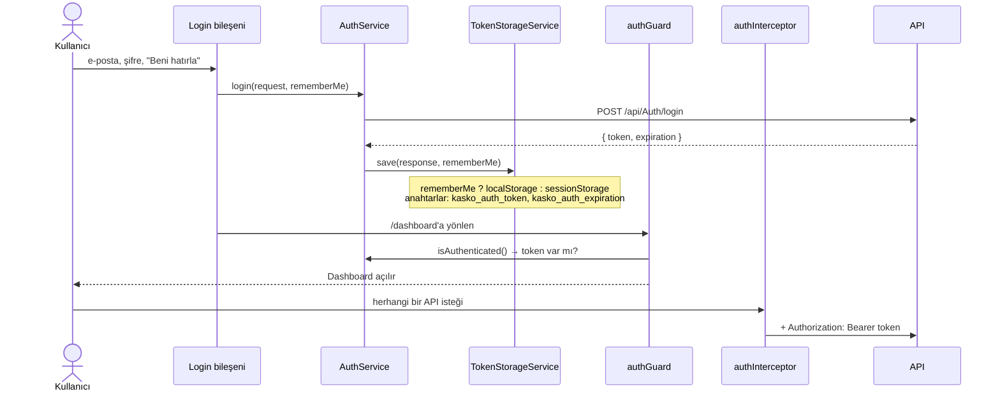

# 07 — Frontend (Angular)

[← 06 Güvenlik](06-Guvenlik.md) · [Ana sayfa](README.md) · Sonraki: [08 — Test Raporu →](08-Test-Raporu.md)

---

## 1. Genel bilgiler

| Özellik | Değer |
|---|---|
| Konum | `Fronted/KaskoManagementSystemFronted` |
| Çatı | Angular ^22.1 (`@angular/build` uygulama builder'ı) |
| Dil | TypeScript ~6.0.2 |
| Bileşen modeli | **%100 standalone** — projede tek bir `@NgModule` yoktur |
| Başlatma | `bootstrapApplication(App, appConfig)` (`src/main.ts`) |
| HTTP | `provideHttpClient(withInterceptors([authInterceptor]))` |
| Formlar | Çoğunlukla template-driven (`FormsModule`); `PolicyCreate` reactive form kullanır |
| Durum yönetimi | Ayrı kütüphane yok; servisler + bileşen alanları, `ChangeDetectorRef` ile manuel değişiklik denetimi |
| UI kütüphanesi | Yok — tüm stiller bileşen `.scss` dosyalarında elle yazılmış |
| Test altyapısı | Vitest + jsdom (CLI tarafından üretilmiş spec dosyaları) |
| Geliştirme sunucusu | `npm start` → `http://localhost:4200` |
| API adresi | Her serviste sabit `https://localhost:7086/api/...` (ortam dosyası yok) |

## 2. Klasör yapısı

```
src/
├── index.html
├── main.ts                      bootstrapApplication
├── styles.scss                  global: html/body tam yükseklik, body overflow gizli
└── app/
    ├── app.ts / app.html        kök bileşen, yalnızca <router-outlet>
    ├── app.config.ts            router + HttpClient + interceptor
    ├── app.routes.ts            tüm rotalar (lazy loading yok)
    │
    ├── core/
    │   ├── guards/
    │   │   ├── auth-guard.ts            token yoksa /login
    │   │   └── role-guards.ts           rol kontrolü (fabrika fonksiyon)
    │   ├── interceptors/
    │   │   └── auth-interceptor.ts      Authorization: Bearer ekler
    │   ├── models/                      LoginRequest, LoginResponse
    │   └── services/
    │       ├── authservice.ts           login / logout / getToken / isAuthenticated
    │       └── token-storage.service.ts localStorage veya sessionStorage
    │
    └── features/
        ├── auth/login/                  giriş ekranı
        ├── quick-quotes/
        │   ├── quick-quote/             herkese açık karşılama sayfası
        │   └── quick-quote-start/       6 adımlı hızlı teklif sihirbazı + servisi
        ├── layout/                      kenar menü + üst çubuk kabuğu
        ├── dashboard/                   kontrol paneli + DashboardService
        ├── customers/                   liste · detay · oluştur · düzenle
        ├── vehicles/                    liste · detay · oluştur · düzenle + VehicleValueService (TSB)
        ├── quotes/                      liste · detay · oluştur · düzenle + paket ve önceki poliçe servisleri
        ├── policies/                    liste · detay · oluştur · düzenle
        ├── payments/                    liste · detay · oluştur
        ├── users/                       liste · detay · oluştur · düzenle
        └── roles/                       liste · detay · oluştur · düzenle
```

Her modül kendi modelini, servisini ve alt bileşenlerini kendi klasöründe tutar. Ortak bileşen (`shared/`) klasörü yoktur; tablo, sayfalama ve arama kutusu gibi yapılar her liste sayfasında ayrı yazılmıştır.

## 3. Rotalar

`app.routes.ts` içindeki 32 sayfa rotası:

### 3.1 Herkese açık

| Yol | Bileşen | Açıklama |
|---|---|---|
| `/` | `QuickQuote` | Karşılama sayfası; "Teklif Al" ve "Giriş" bağlantıları |
| `/quick-quote` | `QuickQuote` | Aynı sayfa |
| `/quick-quote/start` | `QuickQuoteStart` | Hızlı teklif sihirbazı |
| `/login` | `Login` | Giriş ekranı |

### 3.2 Giriş gerektiren (`Layout` altında, `canActivate: [authGuard]`)

| Yol | Bileşen | Ek koruma |
|---|---|---|
| `/dashboard` | `Dashboard` | — |
| `/customers`, `/customers/new`, `/customers/:id`, `/customers/:id/edit` | `Customers`, `CustomerCreate`, `CustomerDetail`, `CustomerEdit` | — |
| `/vehicles`, `/vehicles/new`, `/vehicles/:id`, `/vehicles/:id/edit` | `Vehicle`, `VehicleCreate`, `VehicleDetail`, `VehicleEdit` | — |
| `/quotes`, `/quotes/new`, `/quotes/:id`, `/quotes/:id/edit` | `Quotes`, `QuoteCreate`, `QuoteDetail`, `QuoteEdit` | — |
| `/policies`, `/policies/new`, `/policies/:id`, `/policies/:id/edit` | `Policies`, `PolicyCreate`, `PolicyDetail`, `PolicyEdit` | — |
| `/payments`, `/payments/new`, `/payments/:id` | `Payments`, `PaymentCreate`, `PaymentDetail` | — |
| `/users`, `/users/new`, `/users/:id`, `/users/:id/edit` | `Users`, `UserCreate`, `UserDetail`, `UserEdit` | `roleGuard`, `data: { roles: ['Admin'] }` |
| `/roles`, `/roles/new`, `/roles/:id`, `/roles/:id/edit` | `Roles`, `RoleCreate`, `RoleDetail`, `RoleEdit` | `roleGuard`, `data: { roles: ['Admin'] }` |

Tanımsız her yol (`**`) `/dashboard`'a yönlendirilir; giriş yapılmamışsa `authGuard` oradan `/login`'e gönderir.

> `roleGuard` bir **fabrika fonksiyondur** (`roleGuard(['Admin'])` şeklinde çağrılması gerekir) ancak rotalarda çağrılmadan kaydedilmiştir ve `data.roles` hiç okunmaz. Bu nedenle Kullanıcılar/Roller sayfalarında frontend rol kontrolü **çalışmaz**. Veriler yine gelmez, çünkü API bu uç noktalarda Admin rolünü zorunlu tutar.

## 4. Kimlik doğrulama akışı



| Parça | Davranış |
|---|---|
| `TokenStorageService` | "Beni hatırla" seçiliyse `localStorage` (tarayıcı kapansa da kalır), değilse `sessionStorage` (sekme kapanınca silinir); diğer depoyu temizler |
| `authInterceptor` | `/api/Auth/login` isteği hariç, token varsa her isteğe başlık ekler. 401 yakalama veya otomatik çıkış yapmaz |
| `authGuard` | `isAuthenticated()` yalnızca token **varlığına** bakar; süresini kontrol etmez. Konsola durum ve token yazar |
| Çıkış | `Layout.logout()` `localStorage`/`sessionStorage`'ı temizleyip `window.location.href = '/login'` ile tam sayfa yenileme yapar |

## 5. Servisler ve çağırdıkları uç noktalar

| Servis | Dosya | Uç noktalar |
|---|---|---|
| `AuthService` | `core/services/authservice.ts` | `POST /api/Auth/login` |
| `TokenStorageService` | `core/services/token-storage.service.ts` | — (tarayıcı deposu) |
| `DashboardService` | `features/dashboard/dashboard.service.ts` | `GET` Customer, Vehicle, Quote, Policy, Payment — **`forkJoin` ile paralel** |
| `CustomerService` | `features/customers/customers.service.ts` | `GET`, `GET {id}`, `POST`, `PUT` (id gövdede), `DELETE {id}` |
| `VehiclesService` | `features/vehicles/vehicle.service.ts` | `GET`, `GET ?customerId=`, `GET {id}`, `POST`, `PUT {id}`, `DELETE {id}` |
| `VehicleValueService` | `features/vehicles/vehicle-value.service.ts` | `GET /brands`, `/types`, `/years`, `/lookup` |
| `QuoteService` | `features/quotes/quote.service.ts` | `GET`, `GET {id}`, `POST`, `POST /calculate`, `PUT {id}`, `DELETE {id}`, `PATCH {id}/status?status=` |
| `InsurancePackageService` | `features/quotes/insurance-package.service.ts` | `GET /api/InsurancePackage` |
| `PreviousPolicyService` | `features/quotes/previous-policy.service.ts` | `GET /api/PreviousPolicy/customer/{customerId}` |
| `PolicyService` | `features/policies/policy.service.ts` | `GET`, `GET {id}`, `POST`, `PUT {id}`, `DELETE {id}`, `POST {id}/cancel`, `POST {id}/expire` |
| `PaymentsService` | `features/payments/payments.service.ts` | `GET`, `GET {id}`, `POST` |
| `UserService` | `features/users/users.service.ts` | `GET`, `GET {id}`, `POST`, `PUT` (id gövdede), `DELETE {id}` |
| `RolesService` | `features/roles/roles.service.ts` | `GET`, `GET {id}`, `POST`, `PUT` (id gövdede), `DELETE {id}` |
| `QuickQuoteService` | `features/quick-quotes/quick-quote-start/quick-quote-start-service.ts` | `POST customer/lookup`, `POST customer/vehicles`, `GET packages`, `POST calculate`, `POST compare` |

Tüm servisler `@Injectable({ providedIn: 'root' })` ve `inject(HttpClient)` kullanır. Hiçbir bileşen `HttpClient`'ı doğrudan çağırmaz.

### Arayüzü olmayan backend özellikleri

Aşağıdaki API yetenekleri çalışır ancak Angular'da ekranları **yoktur** (Swagger ile kullanılır):

| Özellik | Uç nokta |
|---|---|
| Fiyat kuralı yönetimi | `/api/PricingRule` |
| Fiyat değişiklik talebi (Manager/Admin) | `/api/PricingRuleChangeRequest` |
| Teminat yönetimi | `POST/PUT/DELETE /api/Coverage` |
| TSB Excel içe aktarma | `POST /api/VehicleValueCatalog/import` |
| Poliçe yenileme | `GET /api/Policy/upcoming-renewals`, `POST /api/Policy/renew` |
| Sigorta şirketi karşılaştırma | `POST /api/QuickQuote/compare` (servis metodu var, bileşen çağırmıyor) |
| Önceki poliçe oluşturma | `POST /api/PreviousPolicy` |

## 6. Ekranlar

### 6.1 Kenar menü (`Layout`)

Kontrol Paneli · Müşteriler · Araçlar · Teklifler · Poliçeler · Ödemeler · Kullanıcılar · Roller · Çıkış

### 6.2 Kontrol paneli

`DashboardService.getDashboardData()` beş listeyi paralel çeker ve istemci tarafında hesaplar:

| Bölüm | İçerik |
|---|---|
| Özet kartları | Toplam müşteri, toplam araç, açık teklif, aktif poliçe |
| Teklif durumları | Taslak, teklif verildi, kabul edildi, reddedildi, iptal, süresi doldu — oransal çubuklar |
| Poliçe durumları | Taslak, aktif, iptal, süresi doldu |
| Son işlemler | Beş kaynaktan birleştirilmiş en yeni kayıtlar |
| Ödeme özeti | Başarılı / başarısız / bekleyen ödeme sayıları |

Tüm kayıtlar tarayıcıya indirilip sayıldığı için veri büyüdükçe panel yavaşlar; sayımların API'de yapılması daha uygundur.

### 6.3 Araç oluşturma / düzenleme

Marka, model ve model yılı serbest metin değil, TSB kataloğuna bağlı **kademeli açılır listelerdir**:

```
Marka seç   → GET /brands
Model seç   → GET /types?brandCode=
Yıl seç     → GET /years?brandCode=&typeCode=
            → GET /lookup  → kasko değeri ekranda gösterilir
Kaydet      → POST/PUT /api/Vehicle  (sunucu değeri yeniden katalogdan alır)
```

Düzenleme ekranı mevcut aracın `brandCode`, `typeCode` ve `modelYear` bilgilerini geri yükler. Seçilen yılın forma bağlı `modelYear` alanıyla eşzamanlı tutulması, geliştirme sırasında giderilen bir hatanın sonucudur. Katalog entegrasyonundan önce oluşturulmuş (`brandCode = NULL`) araçlarda seçimler boş gelir.

### 6.4 Hızlı teklif sihirbazı (`QuickQuoteStart`)

| Adım | Ekran başlığı | Kullanıcı girdisi | API |
|---|---|---|---|
| 1 | Teklif Alın | TC kimlik no / vergi no, telefon | `POST customer/lookup` |
| 2 | Aracınızı Seçin | Kayıtlı aktif araçlardan biri | `POST customer/vehicles` |
| 3 | Risk Bilgileri | Kullanım şekli, hasar sayısı, muafiyet | — |
| 4 | Kasko Paketinizi Seçin | Ekonomik / Standart / Kapsamlı | `GET packages` |
| 5 | Teminatlarınızı Belirleyin | Ek teminatlar | — |
| 6 | Kasko Teklifiniz Hazır | Fiyat dökümü, `totalPremium` | `POST calculate` |

`goToStep(n)` ile önceki adımlara dönülebilir. Sihirbaz teklif **kaydetmez**; yalnızca fiyat gösterir.

## 7. Stil ve tasarım

- Tasarım Figma'da hazırlanmıştır (Design System sayfası): ana renkler `#EEF2F7` (arka plan), `#535353` (birincil), `#000000`; yardımcı ve durum renkleri `#FFFFFF`, `#6B7280`, `#9CA3AF`, `#D8DEE6`, `#22C55E` (başarı), `#F59E0B` (uyarı), `#EF4444` (hata), `#3B82F6` (bilgi).
- Kodda ortak tasarım değişkeni (SCSS değişkeni / CSS custom property) yoktur; renkler bileşen stillerine doğrudan yazılmıştır.
- `styles.scss` yalnızca `html`, `body` ve `app-root`'u tam yüksekliğe ayarlar ve `body` kaydırmasını kapatır; sayfa içi kaydırma bileşenlerin kendi kapsayıcılarında yapılır.

## 8. Geliştirme komutları

```bash
cd Fronted/KaskoManagementSystemFronted
npm install          # bağımlılıklar
npm start            # ng serve → http://localhost:4200
npm run build        # dist/ klasörüne üretim derlemesi
npm test             # ng test (Vitest)
```

API'nin `https://localhost:7086` adresinde çalışıyor olması gerekir. Tarayıcı konsolunda `ERR_CONNECTION_REFUSED` görülüyorsa API başlatılmamıştır.

## 9. Frontend'e özgü teknik borçlar

| # | Konu | Öneri |
|---|---|---|
| F1 | API adresi 13 serviste sabit yazılmış, `environments/` yok | `environment.ts` + `fileReplacements` veya tek bir `API_BASE_URL` injection token |
| F2 | `roleGuard` çağrılmadan kayıtlı | `canActivate: [authGuard, roleGuard(['Admin'])]` |
| F3 | Token süresi kontrol edilmiyor; 401'de otomatik çıkış yok | `isAuthenticated()` içinde `expiration` kontrolü; interceptor'da 401 → `logout()` |
| F4 | `authGuard` ve `app.config.ts` konsola token/rota yazıyor | `console.log` satırlarını kaldırmak |
| F5 | Lazy loading yok; tüm sayfalar ilk yüklemede iniyor | `loadComponent` ile rota bazlı bölme |
| F6 | Ortak bileşen yok (tablo, sayfalama, durum rozeti) | `shared/` klasörü |
| F7 | Tasarım renkleri koda gömülü | Design System renklerini CSS değişkenlerine taşımak |
| F8 | Kontrol paneli tüm kayıtları indiriyor | API'de özet uç noktası (`/api/Dashboard/summary`) |
| F9 | Yenileme, fiyat kuralı, değişiklik talebi, teminat ve TSB içe aktarma ekranları yok | Manager/Admin portalı ekranları |

---

[← 06 Güvenlik](06-Guvenlik.md) · [Ana sayfa](README.md) · Sonraki: [08 — Test Raporu →](08-Test-Raporu.md)
