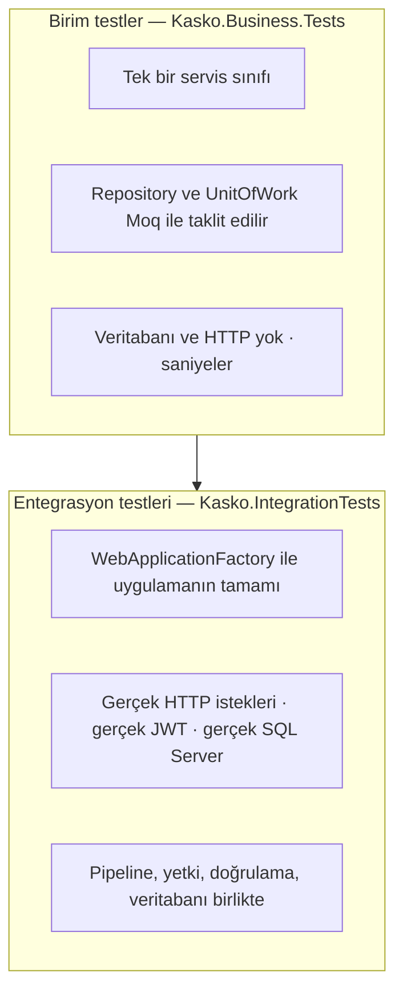

# 08 — Test Raporu

[← 07 Frontend](07-Frontend.md) · [Ana sayfa](README.md) · Sonraki: [09 — Kurulum Rehberi →](09-Kurulum-Rehberi.md)

---

## 1. Özet

| Ölçü | Değer |
|---|---|
| Rapor tarihi | 13.09.2026 |
| Referans commit | `676b33f` |
| Birim test metodu | **191** (13 sınıf) |
| Entegrasyon test metodu | **98** (17 sınıf) |
| Toplam test metodu | **289** |
| Birim test çalıştırması | **201 çalıştırma — 200 başarılı, 1 başarısız, 0 atlanan** (süre ≈ 20 sn) |
| Entegrasyon test çalıştırması | Bu raporda **çalıştırılmadı** (gerekçe: §5) |
| Frontend spec dosyası | 8 (CLI tarafından üretilmiş temel testler) |

Metot sayısı ile çalıştırma sayısı arasındaki fark `[Theory]` testlerinden gelir: tek bir metot her `[InlineData]` satırı için ayrı çalıştırılır (ör. `TurkishPlateNumberTests` 4 metot, 13 veri satırı).

## 2. Test stratejisi



| Seviye | Neyi kanıtlar | Neyi kanıtlamaz |
|---|---|---|
| **Birim** | İş kuralı doğru mu? Doğru hata fırlatılıyor mu? Doğru repository metodu çağrılıyor mu? | Rota, `[Authorize]`, DTO bağlama, SQL indeksleri, EF sorgu çevirisi |
| **Entegrasyon** | İstek uçtan uca doğru durum kodunu ve veriyi üretiyor mu? Veritabanına gerçekten yazılıyor mu? Yetki çalışıyor mu? | Hataların kök nedeni (daha yavaş ve daha kırılgan) |

### Kullanılan araçlar

| Araç | Sürüm | Görevi |
|---|---|---|
| xUnit | 2.5.3 | Test çatısı (`[Fact]`, `[Theory]`) |
| Moq | 4.20.72 | Bağımlılık taklidi (`Setup`, `ReturnsAsync`, `Verify`) |
| Microsoft.AspNetCore.Mvc.Testing | 8.0.20 | `WebApplicationFactory<Program>` |
| coverlet.collector | 6.0.0 | Kod kapsamı toplama |

## 3. Birim testler — `Kasko.Business.Tests`

### 3.1 Sınıf bazında dağılım

| Test sınıfı | Metot | Kapsadığı konu |
|---|---|---|
| `QuoteServiceTests` | 43 | Teklif oluşturma kontrolleri, teminat çözümü, snapshot, durum makinesi, getirme |
| `PricingServiceTests` | 31 | Tüm katsayılar, kural bulunamaması, paket/teminat, muafiyet, sürüm seçimi |
| `PolicyServiceTests` | 31 | Poliçe oluşturma kuralları, RowVersion, iptal, süre dolumu, yenileme |
| `PaymentServiceTests` | 17 | Başarılı/başarısız ödeme, tekrar ödeme engeli, poliçe aktifleşmesi |
| `VehicleServicesTests` | 17 | Plaka/VIN benzersizliği, TSB değeri, BrandCode/TypeCode |
| `CustomerServiceTest` | 14 | TC kimlik ve e-posta benzersizliği, CRUD |
| `UserServicesTests` | 13 | E-posta benzersizliği, rol kontrolü, CRUD |
| `VehicleTechnicalSpecificationParserTests` | 8 | Tip adından motor hacmi, güç, yakıt, vites, gövde çıkarımı |
| `PricingRuleServiceTests` | 7 | Sürüm numarası artışı, önceki sürümü kapatma |
| `TurkishPlateNumberTests` | 4 (13 satır) | Normalize, geçerli/geçersiz plaka, görüntüleme biçimi |
| `PricingRuleChangeRequestServiceTests` | 3 | Talep oluşturma, onayda yeni sürüm, redde kuralın değişmemesi |
| `InsurancePackageServiceTests` | 2 | Paket listesi ve teminatları |
| `VehicleValueImportServiceTests` | 1 | İçe aktarma temel senaryosu |
| **Toplam** | **191** | |

Birim testi **olmayan** sınıflar: `AuthService`, `CoverageService`, `RoleService`, `PreviousPolicyService`, `VehicleValueCatalogService`, `InsurerQuoteComparisonService`, demo sağlayıcılar, `VehicleCategoryClassifier`, FluentValidation doğrulayıcıları.

### 3.2 Örnek birim test yapısı

`PricingRuleChangeRequestServiceTests.cs` dosyasından kısaltılmış gerçek örnek (Arrange–Act–Assert):

```csharp
[Fact]
public async Task RejectAsync_WhenPendingRequest_ShouldRejectWithoutChangingPricingRule()
{
    // Arrange — veritabanı yerine taklit repository'ler
    var currentRule = new PricingRule { Id = ruleId, Code = "BASE_KASKO_RATE", Value = 0.0200m, Version = 2, IsActive = true };
    var request = new PricingRuleChangeRequest { Id = requestId, PricingRuleId = ruleId, NewValue = 0.0300m, Status = "Pending" };

    _changeRequestRepositoryMock.Setup(x => x.GetByIdAsync(requestId)).ReturnsAsync(request);
    _pricingRuleRepositoryMock.Setup(x => x.GetByIdAsync(ruleId)).ReturnsAsync(currentRule);
    _unitOfWorkMock.Setup(x => x.SaveChangesAsync()).ReturnsAsync(1);

    // Act
    await _service.RejectAsync(requestId, rejectedBy);

    // Assert — talep reddedildi, kural hiç değişmedi
    Assert.Equal("Rejected", request.Status);
    Assert.Equal(rejectedBy, request.ApprovedBy);
    Assert.Equal(0.0200m, currentRule.Value);
    Assert.Equal(2, currentRule.Version);
    _pricingRuleRepositoryMock.Verify(x => x.AddAsync(It.IsAny<PricingRule>()), Times.Never);
    _changeRequestRepositoryMock.Verify(x => x.UpdateAsync(request), Times.Once);
    _unitOfWorkMock.Verify(x => x.SaveChangesAsync(), Times.Once);
}
```

### 3.3 Çalıştırma sonucu (13.09.2026)

```
dotnet test Kasko.Business.Tests/Kasko.Business.Tests.csproj

Başarısız! - Başarısız: 1, Başarılı: 200, Atlanan: 0, Toplam: 201, Süre: 20 s
```

### 3.4 Başarısız test analizi

**Test:** `QuoteServiceTests.GetByIdAsync_ShouldReturnQuote_WhenQuoteExists`

```
System.NullReferenceException : Object reference not set to an instance of an object.
   at Kasko.Business.Services.QuoteService.GetByIdAsync(Guid id)        QuoteService.cs:147
   at ...QuoteServiceTests.GetByIdAsync_ShouldReturnQuote_WhenQuoteExists() QuoteServiceTests.cs:1903
```

**Kök neden:** `QuoteDto` sonradan müşteri ve araç bilgileriyle genişletilmiş; `GetByIdAsync` artık şu satırları çalıştırıyor:

```csharp
CustomerName  = $"{quote.Customer.FirstName} {quote.Customer.LastName}",   // satır 147
CustomerEmail = quote.Customer.Email,
```

Test ise taklit `Quote` nesnesine `Customer` (ve `Vehicle`) navigasyonunu atamıyor; `quote.Customer` null olduğu için hata oluşuyor.

**Değerlendirme:** Bu yalnızca eskimiş bir test değil, bir üretim riskini de gösteriyor. Soft-delete global filtresi nedeniyle **müşterisi silinmiş bir teklif** `Include` ile yüklendiğinde `quote.Customer` gerçekten null gelir ve aynı satır `500` hatası üretir.

**Önerilen düzeltme:**

1. Testte taklit teklife `Customer` ve `Vehicle` nesneleri atanmalı.
2. Serviste null güvenli erişim kullanılmalı:

```csharp
CustomerName  = quote.Customer is null ? "—" : $"{quote.Customer.FirstName} {quote.Customer.LastName}",
CustomerEmail = quote.Customer?.Email ?? string.Empty,
```

## 4. Entegrasyon testleri — `Kasko.IntegrationTests`

### 4.1 Sınıf bazında dağılım

| Test sınıfı | Metot | Kapsadığı konu |
|---|---|---|
| `QuoteIntegrationTests` | 22 | Teklif + teminat + snapshot oluşumu, tüm durum geçişleri, poliçeye dönüşüm, önceki poliçe, paket varsayılan teminatları, **eski teklifin snapshot'ının yeni kural sürümünde korunması**, `EffectiveDate` ile sürüm seçimi |
| `VehicleValueCatalogRepositoryTests` | 15 | Aktif marka/tip/yıl sorguları, silinmiş ve pasif kayıt filtreleri, sıralama, anahtarla arama |
| `ResourceAuthorizationTests` | 11 | Customer rolünün başkasının araç/teklif/poliçesine erişememesi; listelerde yalnızca kendi kayıtları |
| `CoverageIntegrationTests` | 11 | Teminat CRUD, rol yetkileri, doğrulama |
| `PricingRuleChangeRequestIntegrationTests` | 8 | Manager talebi, Admin onay/red, yanlış rol denemeleri |
| `PricingRuleIntegrationTests` | 8 | Kural CRUD, Admin/Manager/Customer yetki farkları |
| `AuthenticationTests` | 6 | Geçerli/geçersiz giriş, giriş uç noktasının anonim olması, token'sız isteklerde 401 |
| `InsurancePackageIntegrationTests` | 4 | Paket listesi ve teminatları |
| `PricingServiceIntegrationTests` | 3 | Gerçek veritabanı kurallarıyla fiyat hesabı |
| `E2ELifecycleTests` | 2 | Müşteri → araç → teklif → poliçe → ödeme → aktif poliçe (snapshot doğrulamalı); başarısız ödemede poliçenin Draft kalması |
| `ProblemDetailsTests` | 2 | Hata yanıtı biçimi (`status`, `title`, `traceId`) |
| `ApiSmokeTests` | 1 | `/swagger/index.html` erişilebilir |
| `HealthCheckTests` | 1 | `GET /health` → 200 |
| `CorsTests` | 1 | `Origin: http://localhost:4200` preflight yanıtı |
| `ConcurrencyTests` | 1 | Eski RowVersion ile güncelleme → 409 |
| `SoftDeleteTests` | 1 | Silinen müşterinin listede dönmemesi |
| `PricingRuleVersioningTests` | 1 | Tarihe göre doğru sürümün seçilmesi |
| **Toplam** | **98** | |

### 4.2 Altyapı

- **Fabrika:** Her test `await using var factory = new WebApplicationFactory<Program>();` ile uygulamayı bellekte ayağa kaldırır. `Program.cs` sonundaki `public partial class Program { }` bu yüzden vardır. Ayrı bir fabrika alt sınıfı veya `IClassFixture` yoktur.
- **Veritabanı:** Testler **gerçek** `DefaultConnection`'a (geliştirme SQL Server'ı) bağlanır; in-memory veya ayrı test veritabanı yoktur. Çakışmalar Guid ekli benzersiz verilerle önlenir (`integration.admin.{guid}@test.local`).
- **Paralellik:** `AssemblyInfo.cs` → `[assembly: CollectionBehavior(DisableTestParallelization = true)]`; testler sırayla çalışır.
- **Kimlik:** Sahte kimlik doğrulama yoktur. Token gerçek `/api/Auth/login` üzerinden alınır; dolayısıyla JWT zinciri de test edilir.

### 4.3 `IntegrationTestHelper`

| Metot | Görevi |
|---|---|
| `SeedUserAsync(factory, role, customerId?)` | Rolü bulur/oluşturur; `PasswordHasher<User>` ile parolası `IntegrationTest123!` olan kullanıcıyı doğrudan `KaskoContext`'e ekler; isteğe bağlı müşteriye bağlar |
| `LoginAsync(factory, user)` | `/api/Auth/login` çağırır, `Authorization: Bearer` başlıklı `HttpClient` döner |
| `CreateCustomerAsync(client)` | Rastgele TC kimlik ve e-postayla müşteri oluşturur, 201 bekler |
| `CreateVehicleAsync(factory, client, customerId)` | Benzersiz bir TSB katalog kaydı ekler, `marketValue = 1` ile araç oluşturur ve yanıtın **katalog değerini** (1.250.000) taşıdığını doğrular |
| `CreateQuoteAsync(client, customerId, vehicleId)` | 30 gün geçerli teklif |
| `ChangeQuoteStatusAsync(client, quoteId, status)` | `PATCH .../status?status=` |
| `CreatePolicyAsync(client, customerId, vehicleId, quoteId)` | 1 yıllık poliçe |
| `GetQuotePricingSnapshotAsync(factory, quoteId)` | Snapshot'ı doğrudan veritabanından okur |

### 4.4 Örnek uçtan uca test akışı

```
E2ELifecycleTests.FullPolicyLifecycle_ShouldCompleteSuccessfully
  1. SeedUserAsync(Admin) → LoginAsync
  2. CreateCustomerAsync                       → 201
  3. CreateVehicleAsync                        → marketValue = katalog değeri
  4. CreateQuoteAsync                          → Draft
  5. Snapshot veritabanında var mı, FinalPremium/MarketValue/BaseRate doğru mu?
  6. ChangeQuoteStatus Offered → Accepted
  7. CreatePolicyAsync                         → Draft
  8. POST /api/Payment                         → Successful
  9. GET /api/Policy/{id}                      → Active
```

## 5. Entegrasyon testleri neden bu raporda çalıştırılmadı?

Entegrasyon testleri geliştirme veritabanına **gerçek kayıt yazar** (kullanıcı, müşteri, araç, teklif, poliçe, ödeme, katalog satırı ve bazı testlerde fiyat kuralı). Dokümantasyon hazırlanırken çalışma veritabanı değiştirilmemek için yalnızca birim testler çalıştırılmıştır.

Kod incelemesine göre, çalıştırıldığında **başarısız olması beklenen** testler:

| Test | Beklenen sonuç | Neden |
|---|---|---|
| `ResourceAuthorizationTests.Customer_Can_Get_Only_Own_Vehicles_From_List` | ✘ | `VehicleService.GetAllAsync` rol filtresi uygulamıyor |
| `ResourceAuthorizationTests.Customer_Can_Get_Only_Own_Quotes_From_List` | ✘ | `QuoteService.GetAllAsync` rol filtresi uygulamıyor |
| `ResourceAuthorizationTests.Customer_Can_Get_Only_Own_Policies_From_List` | ✘ | `PolicyService.GetAllAsync` rol filtresi uygulamıyor |

Testlerin kendisi çalıştırılmamıştır; ancak aynı davranış geçici bir veritabanına kurulan API'ye gerçek isteklerle sınanmış ve Customer rolündeki kullanıcının listelerde başka müşterinin araç ve tekliflerini gördüğü **doğrulanmıştır** (ayrıntı: [06 — Güvenlik §5.3](06-Guvenlik.md#53-canlı-doğrulama-13092026)). Kesin test sonucu için §6'daki komut çalıştırılmalıdır.

### 5.1 Sıfırdan kurulum doğrulaması

Kurulum rehberindeki adımlar aynı geçici veritabanında uygulanmıştır:

| Adım | Sonuç |
|---|---|
| Boş veritabanında `dotnet ef database update` | ✘ `FK_PackageCoverages_Coverages_CoverageId` ihlali — 22. migration'da durdu (beklenen) |
| 3 teminatın SQL ile eklenmesi + tekrar `database update` | ✔ 34/34 migration, 8 paket-teminat, 20 fiyat kuralı |
| Roller + SQL ile Admin (Python ile üretilmiş Identity v3 hash) | ✔ |
| `GET /health` | ✔ `Healthy` |
| Admin girişi / yanlış parola | ✔ 200 token / 400 |
| Token'sız `GET /api/Customer` | ✔ 401 |
| Araç oluşturma (`marketValue: 1` gönderildi) | ✔ 201, `marketValue: 1250000` (katalogdan) |
| Teklif (2017 araç, 36 yaş sürücü, hasarsız, teminatsız) | ✔ 201, `premiumAmount: 32653.12` ([04 §7.5](04-Is-Kurallari.md#75-örnek-hesaplama) ile uyumlu) |
| `POST /api/QuickQuote/compare` | ✘ Üç sağlayıcıda `premium: 0.0`; `totalPremium` yuvarlanmamış (`32000.0576`, `33632.7136`, `35265.3696`) |

## 6. Testleri çalıştırma

```bash
cd Backend/KaskoManagementSystem

# Birim testler (veritabanı gerekmez)
dotnet test Kasko.Business.Tests/Kasko.Business.Tests.csproj

# Tek bir test
dotnet test Kasko.Business.Tests/Kasko.Business.Tests.csproj \
  --filter "FullyQualifiedName~GetByIdAsync_ShouldReturnQuote_WhenQuoteExists"

# Hata ayrıntısıyla
dotnet test Kasko.Business.Tests/Kasko.Business.Tests.csproj --logger "console;verbosity=detailed"

# Entegrasyon testleri — DİKKAT: DefaultConnection veritabanına yazar
dotnet test Kasko.IntegrationTests/Kasko.IntegrationTests.csproj

# Kod kapsamı
dotnet test --collect:"XPlat Code Coverage"
```

Entegrasyon testleri için gereksinimler: SQL Server erişilebilir, tüm migration'lar uygulanmış, `Kasko.API` User Secrets'ında `Jwt:Key` tanımlı (bkz. [09 — Kurulum](09-Kurulum-Rehberi.md)).

Visual Studio'da: **Test → Test Explorer → Run All**.

## 7. Test sayısının gelişimi

Staj defterine kaydedilmiş kontrol noktaları:

| Tarih | Toplam | Not |
|---|---|---|
| 17.08.2026 | 59 | İlk birim testler, RowVersion |
| 19.08.2026 | 132 | 117 birim + 15 entegrasyon; backend ilk sürüm tamam |
| 31.08.2026 | 179 | Snapshot doğrulaması, DI düzeltmesi sonrası |
| 01.09.2026 | 186 | Versiyonlama ve önceki poliçe |
| 02.09.2026 | 204 | Araç/TSB testleri |
| 13.09.2026 | 289 metot | Quick Quote, kaynak yetkilendirme, plaka ve teknik özellik testleri eklendi |

## 8. Öneriler

1. Başarısız birim testi düzeltilmeli ve `QuoteService.GetByIdAsync` null güvenli yapılmalı.
2. Liste uç noktalarına Customer filtresi eklenerek `ResourceAuthorizationTests` yeşile döndürülmeli.
3. Entegrasyon testleri ayrı bir test veritabanına yönlendirilmeli: `WebApplicationFactory` alt sınıfında `ConfigureWebHost` ile bağlantı dizesi değiştirilip test başında migration uygulanmalı.
4. Birim testi olmayan servisler (özellikle `AuthService`, `InsurerQuoteComparisonService`) ve FluentValidation doğrulayıcıları için testler eklenmeli. `InsurerQuoteComparisonService` testi, `FinalPremium = 0` hatasını hemen yakalardı.
5. CI (GitHub Actions) ile her push'ta birim testler otomatik çalıştırılmalı.

---

[← 07 Frontend](07-Frontend.md) · [Ana sayfa](README.md) · Sonraki: [09 — Kurulum Rehberi →](09-Kurulum-Rehberi.md)
