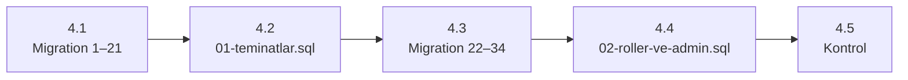

# 09 — Kurulum Rehberi

[← 08 Test Raporu](08-Test-Raporu.md) · [Ana sayfa](README.md) · Sonraki: [10 — Demo Senaryosu →](10-Demo-Senaryosu.md)

---

Bu rehber projeyi **boş bir bilgisayarda sıfırdan** çalışır hâle getirir. Adımlar 13.09.2026'da boş bir SQL Server veritabanı üzerinde uygulanarak doğrulanmıştır (bkz. [08 — Test Raporu §5.1](08-Test-Raporu.md#51-sıfırdan-kurulum-doğrulaması)).

> ⚠️ **Önemli:** Sadece `Update-Database` çalıştırmak temiz bir veritabanında **başarısız olur** ve kurulumdan sonra **giriş yapılabilecek kullanıcı yoktur**. §4'teki önyükleme adımları zorunludur.

## 1. Gereksinimler

| Yazılım | Sürüm | Not |
|---|---|---|
| .NET SDK | 8 veya üstü | Projeler `net8.0` hedefler; çalıştırmak için **.NET 8 çalışma zamanı** gerekir |
| SQL Server | 2019+ (Express / Developer / LocalDB) | Geliştirme ortamında SQL Server 2025 kullanıldı |
| Node.js | `^22.22.3`, `^24.15.0` veya `≥ 26` | Angular 22.1 paketlerinin `engines` gereksinimi |
| npm | Node ile gelir | |
| EF Core araçları | Visual Studio Package Manager Console **veya** `dotnet-ef` | CLI için: `dotnet tool install --global dotnet-ef --version 8.0.20` |
| sqlcmd veya SSMS | — | Önyükleme SQL betikleri için |
| Python 3 | — | Yalnızca ilk Admin parolasının hash'ini üretmek için |
| Visual Studio 2022 / VS Code | — | İsteğe bağlı |

## 2. Kodu indirme

```bash
git clone https://github.com/yusufkaradas/Sigorta-Satis-Proje.git
cd Sigorta-Satis-Proje
```

## 3. Backend yapılandırması

### 3.1 Bağlantı dizesi

`Backend/KaskoManagementSystem/Kasko.API/appsettings.json`:

```json
"ConnectionStrings": {
  "DefaultConnection": "Server=.;Database=KaskoManagementDb;Trusted_Connection=True;TrustServerCertificate=True"
}
```

| Ortam | `Server` değeri |
|---|---|
| Varsayılan yerel örnek | `.` |
| SQL Server Express | `.\SQLEXPRESS` |
| LocalDB | `(localdb)\MSSQLLocalDB` |

Dosyayı değiştirmek istemiyorsanız ortam değişkeni kullanılabilir (ASP.NET Core ve `dotnet ef` ikisi de okur):

```powershell
$env:ConnectionStrings__DefaultConnection = "Server=.\SQLEXPRESS;Database=KaskoManagementDb;Trusted_Connection=True;TrustServerCertificate=True"
```

### 3.2 JWT imza anahtarı (zorunlu)

`Jwt:Key` güvenlik nedeniyle `appsettings.json`'da **yoktur**. Tanımlanmazsa API *"JWT Key bulunamadı."* hatasıyla çalışmaz.

```bash
cd Backend/KaskoManagementSystem
dotnet user-secrets set "Jwt:Key" "en-az-32-karakterlik-rastgele-bir-anahtar-yazin-buraya!" --project Kasko.API
dotnet user-secrets list --project Kasko.API
```

Anahtar HMAC-SHA256 için **en az 32 bayt** olmalıdır; kısa anahtar `IDX10720` hatası verir. Güçlü anahtar üretmek için:

```powershell
$b = New-Object byte[] 48; [Security.Cryptography.RandomNumberGenerator]::Create().GetBytes($b); [Convert]::ToBase64String($b)
```

Diğer JWT ayarları (`appsettings.json`): `Issuer = Kasko.API`, `Audience = Kasko.Client`, `ExpireMinutes = 60`.

### 3.3 HTTPS geliştirme sertifikası

```bash
dotnet dev-certs https --trust
```

## 4. Veritabanını oluşturma

### Neden özel adım gerekiyor?

1. `SeedPackageCoverages` migration'ı üç teminat Id'sine başvurur, ancak bu teminatları **hiçbir migration eklemez**. Boş veritabanında şu hata alınır:

   ```
   The INSERT statement conflicted with the FOREIGN KEY constraint
   "FK_PackageCoverages_Coverages_CoverageId".
   ```

2. `Roles` ve `Users` tabloları için seed yoktur. Kullanıcı oluşturma uç noktası Admin yetkisi istediği için ilk Admin API ile oluşturulamaz.

Çözüm: migration'ları iki parçada uygulamak ve arada / sonda iki SQL betiği çalıştırmak. Betikler depoda hazırdır: [`Documents/kurulum/`](kurulum/).



### 4.1 İlk 21 migration'ı uygulama

**Visual Studio (Package Manager Console)** — *Default project:* `Kasko.DataAccess`, *Startup project:* `Kasko.API`

```powershell
Update-Database -Migration 20260828141258_SeedInsurancePackages
```

**veya komut satırı**

```bash
cd Backend/KaskoManagementSystem
dotnet ef database update 20260828141258_SeedInsurancePackages --project Kasko.DataAcces --startup-project Kasko.API
```

> Klasör adı `Kasko.DataAcces` (tek *s*), proje adı `Kasko.DataAccess`'tir.

### 4.2 Eksik teminatları ekleme

```bash
sqlcmd -S . -E -C -d KaskoManagementDb -b -i Documents/kurulum/01-teminatlar.sql
```

Betik, paketlerin beklediği üç teminatı Id'leriyle ekler:

| Id | Ad | Fiyatlandırma |
|---|---|---|
| `DD1B1CC2-8B4F-43AA-8ED6-81BFE49200DF` | Cam Kırılması | Sabit 2.000 TL |
| `A0DD1498-C060-4547-8FA4-9D5CC54C9BF0` | Hırsızlık | Araç değerinin %0,5'i |
| `7733CFDE-16A2-4329-B613-52A2F5CC8F1B` | Hırsızlık Teminatı | Sabit 1.500 TL |

Ad ve fiyatlar örnektir; Id'ler **değiştirilmemelidir**. `PricingType` mutlaka `1` veya `2` olmalıdır (kolonun varsayılanı olan `0` fiyat hesabında hata verir).

> **sqlcmd notu:** sqlcmd varsayılan olarak `QUOTED_IDENTIFIER OFF` ile çalışır; filtrelenmiş indeksli tablolara ekleme bu durumda *"INSERT failed because the following SET options have incorrect settings: 'QUOTED_IDENTIFIER'"* hatası verir. Betiklerin başındaki `SET QUOTED_IDENTIFIER ON;` bu yüzden vardır. SSMS'de bu ayar zaten açıktır.

### 4.3 Kalan migration'ları uygulama

```powershell
Update-Database
```

```bash
dotnet ef database update --project Kasko.DataAcces --startup-project Kasko.API
```

Beklenen son satır: `Done.`

### 4.4 Rolleri ve ilk Admin kullanıcısını oluşturma

**1) Parola hash'i üretin** (ASP.NET Core Identity v3 formatı, `PasswordHasher<User>` ile uyumlu):

```bash
python Documents/kurulum/hash_uret.py "GucluParola123!"
# AQAAAAIAAYagAAAAE...   ← bu değeri kopyalayın
```

**2)** `Documents/kurulum/02-roller-ve-admin.sql` dosyasında `<HASH_BURAYA>` yerine hash'i yapıştırın. İsterseniz e-posta (`admin@kasko.local`) ve adı değiştirin.

**3) Çalıştırın:**

```bash
sqlcmd -S . -E -C -d KaskoManagementDb -b -i Documents/kurulum/02-roller-ve-admin.sql
```

Betik `Admin`, `Manager`, `Customer` rollerini (yoksa) ve Admin kullanıcısını oluşturur. Parola, sistemin kurallarına uymak zorunda değildir (kural yalnızca API ile oluşturmada uygulanır) ama güçlü bir parola kullanılması önerilir.

<details>
<summary>Python yoksa: PowerShell ile hash üretme</summary>

```powershell
$password = "GucluParola123!"
$salt = New-Object byte[] 16; [Security.Cryptography.RandomNumberGenerator]::Create().GetBytes($salt)
$kdf = New-Object Security.Cryptography.Rfc2898DeriveBytes($password, $salt, 100000, [Security.Cryptography.HashAlgorithmName]::SHA512)
$subkey = $kdf.GetBytes(32)
$header = [byte[]](0x01, 0,0,0,2, 0,1,0x86,0xA0, 0,0,0,16)   # v3, HMACSHA512, 100000, salt=16
[Convert]::ToBase64String([byte[]]($header + $salt + $subkey))
```

Bu betik Windows PowerShell 5.1'de denenmiş ve üretilen hash `PasswordHasher<User>` tarafından `Success` olarak doğrulanmıştır.

</details>

### 4.5 Kontrol

```sql
SELECT COUNT(*) AS Migration      FROM __EFMigrationsHistory;   -- 34
SELECT COUNT(*) AS PaketTeminat   FROM PackageCoverages;        -- 8
SELECT COUNT(*) AS FiyatKurali    FROM PricingRules;            -- 20
SELECT r.Name, u.Email FROM Roles r LEFT JOIN Users u ON u.RoleId = r.Id;
```

### Alternatif: SQL betiğiyle kurulum

Kök dizindeki `database_schema.sql`, tüm migration'ların idempotent betiğidir. Aynı sorun bu betikte de vardır: `SeedPackageCoverages` bölümünden (`20260828141832`) önce `01-teminatlar.sql` çalıştırılmalıdır. Bu nedenle §4.1–4.3 yolu önerilir.

## 5. API'yi çalıştırma

```bash
cd Backend/KaskoManagementSystem
dotnet run --project Kasko.API --launch-profile https
```

| Adres | Açıklama |
|---|---|
| `https://localhost:7086/swagger` | Swagger UI |
| `https://localhost:7086/health` | `Healthy` dönmeli |
| `http://localhost:5117` | HTTP (HTTPS'e yönlendirilir) |

Visual Studio'da `Kasko.API` başlangıç projesi yapılıp **https** profiliyle F5.

### İlk giriş (Swagger)

1. `POST /api/Auth/login` → `{ "email": "admin@kasko.local", "password": "GucluParola123!" }`
2. Yanıttaki `token` değerini kopyalayın.
3. Sağ üstteki **Authorize** düğmesine token'ı yapıştırın (`Bearer` yazmadan).
4. `GET /api/Role` 200 dönüyorsa kurulum tamamdır.

## 6. TSB araç değer kataloğunu içe aktarma

Araç oluşturabilmek için katalogda kayıt olmalıdır; aksi hâlde *"Seçilen marka, araç tipi ve model yılı için TSB araç değeri bulunamadı."* hatası alınır.

1. Swagger'da Admin olarak giriş yapın.
2. `POST /api/VehicleValueCatalog/import` → **Try it out** → `file` alanına `Documents/202608R4.xlsx` dosyasını seçin → **Execute**.
3. Yanıttaki `importedCount` değerini kontrol edin.

```sql
SELECT COUNT(*) FROM VehicleValueCatalogs WHERE IsDeleted = 0 AND IsActive = 1;   -- ~79.380
```

Dosya biçimi: `Smarka` adlı sayfa, 2. satırda yıl başlıkları, 3. satırdan itibaren veri (ayrıntı: [04 §4](04-Is-Kurallari.md#4-tsb-araç-değer-kataloğu)). İçe aktarma aynı dosya için tekrar çalıştırılırsa kayıtlar `duplicateCount` olarak atlanır.

## 7. Frontend'i çalıştırma

```bash
cd Fronted/KaskoManagementSystemFronted
npm install
npm start
```

`http://localhost:4200` açılır:

| Sayfa | Adres |
|---|---|
| Hızlı teklif (herkese açık) | `http://localhost:4200/` |
| Giriş | `http://localhost:4200/login` |
| Kontrol paneli | `http://localhost:4200/dashboard` |

API adresi servislerde `https://localhost:7086` olarak sabittir; API başka bir adreste çalışıyorsa `src/app/**/**.service.ts` dosyalarındaki `apiUrl` değerleri değiştirilmelidir. CORS yalnızca `localhost:4200`'e izin verir.

## 8. Testleri çalıştırma

```bash
cd Backend/KaskoManagementSystem
dotnet test Kasko.Business.Tests/Kasko.Business.Tests.csproj        # veritabanı gerekmez
dotnet test Kasko.IntegrationTests/Kasko.IntegrationTests.csproj    # DefaultConnection veritabanına YAZAR
```

Entegrasyon testleri için §3.2'deki `Jwt:Key` tanımlı ve tüm migration'lar uygulanmış olmalıdır. Ayrıntı: [08 — Test Raporu](08-Test-Raporu.md).

## 9. Müşteri rolünde kullanıcı oluşturma

Customer rolündeki kullanıcının kendi kayıtlarına erişebilmesi için bir müşteriye bağlanması gerekir:

1. Admin ile müşteri oluşturun (`POST /api/Customer`) ve `GET /api/Customer` ile Id'sini alın.
2. `GET /api/Role` ile `Customer` rolünün Id'sini alın.
3. Kullanıcıyı oluşturun:

```json
POST /api/User
{
  "firstName": "Ali", "lastName": "Veli",
  "email": "ali@example.com", "password": "Guclu123!",
  "roleId": "<Customer rol Id>",
  "customerId": "<müşteri Id>"
}
```

## 10. Sorun giderme

| Belirti | Neden | Çözüm |
|---|---|---|
| `JWT Key bulunamadı.` | User Secrets'ta `Jwt:Key` yok | §3.2 |
| `IDX10720` / anahtar boyutu hatası | Anahtar 256 bitten kısa | En az 32 karakterlik anahtar |
| Migration'da `FK_PackageCoverages_Coverages_CoverageId` | Teminat önyüklemesi yapılmadı | §4.1–4.3 |
| sqlcmd'de `QUOTED_IDENTIFIER` hatası | sqlcmd varsayılan ayarı | Betiğin başına `SET QUOTED_IDENTIFIER ON;` veya `sqlcmd -I` |
| `A network-related or instance-specific error` | SQL Server çalışmıyor / yanlış örnek adı | Hizmeti başlatın, `Server=` değerini düzeltin |
| Giriş 404 *Email veya şifre hatalı.* | Kullanıcı yok | §4.4 |
| Giriş 400 *Email veya şifre hatalı.* | Hash yanlış kopyalandı | Hash'i yeniden üretip güncelleyin |
| Tarayıcıda `ERR_CONNECTION_REFUSED` (`:7086`) | API çalışmıyor | §5 |
| Tarayıcıda `NET::ERR_CERT_AUTHORITY_INVALID` | Geliştirme sertifikası güvenilir değil | `dotnet dev-certs https --trust`, sonra `https://localhost:7086/swagger` sayfasını bir kez açın |
| Tarayıcıda CORS hatası | Frontend 4200 dışında bir portta **veya** API 500 döndü (500'de CORS başlığı eklenmez) | Portu kontrol edin; API log'unda hatayı arayın |
| Araç oluştururken 404 TSB değeri bulunamadı | Katalog boş veya kod/yıl yanlış | §6 |
| Fiyat hesabında 500 | Teminatın `PricingType = 0` veya yüzdeli teminatta `Rate` boş; kural eksik | Teminatı düzeltin; `PricingRules` kayıtlarını kontrol edin |
| 400 ve `errors` nesnesi | FluentValidation | Yanıt gövdesindeki `errors` alanını okuyun |
| 409 poliçe güncellemede | Başkası kaydı değiştirmiş | Poliçeyi yeniden getirip güncel `rowVersion` ile gönderin |
| `npm install` motor uyarısı | Node sürümü desteklenmiyor | §1'deki Node sürümü |

---

[← 08 Test Raporu](08-Test-Raporu.md) · [Ana sayfa](README.md) · Sonraki: [10 — Demo Senaryosu →](10-Demo-Senaryosu.md)
