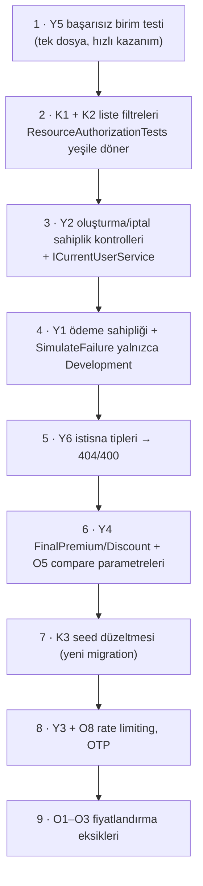

# 11 — Bilinen Sorunlar ve Yol Haritası

[← 10 Demo Senaryosu](10-Demo-Senaryosu.md) · [Ana sayfa](README.md)

---

Bu liste 13.09.2026 tarihli kod incelemesinin (`676b33f`) sonucudur. **Doğrulama** sütunu bulgunun nasıl kanıtlandığını gösterir:

| Doğrulama | Anlamı |
|---|---|
| **Canlı** | Geçici bir veritabanına kurulan API'ye gerçek HTTP isteğiyle tekrarlandı |
| **Test** | Otomatik test çalıştırmasıyla görüldü |
| **Kod** | Kaynak kod okunarak tespit edildi, çalıştırılarak tekrarlanmadı |

Satır numaraları referans commit'e göredir.

## 1. Kritik

| # | Sorun | Etki | Konum | Doğrulama | Önerilen çözüm |
|---|---|---|---|---|---|
| K1 | **Customer rolü tüm müşterileri listeleyebiliyor** (TC kimlik no, e-posta, telefon, adres dahil) | Kişisel veri sızıntısı | `CustomerService.cs:25` `GetAllAsync`, `:43` `GetByIdAsync`; `CustomerController` | Canlı | Customer rolüne bu uç noktaları kapatmak (`[Authorize(Roles = "Admin,Manager")]`) veya yalnızca kendi kaydını döndürmek |
| K2 | **Liste uç noktaları Customer rolünü filtrelemiyor** — başka müşterilerin teklif, poliçe, ödeme ve araçları görünür | Veri sızıntısı; `ResourceAuthorizationTests` içindeki 3 liste testiyle çelişki | `QuoteService.cs:28`, `PolicyService.cs:229`, `PaymentService.cs:154`, `VehicleService.cs:23` | Canlı (teklif, araç) · Kod (poliçe, ödeme) | Rol Customer ise `currentUser.CustomerId` ile filtre; `VehicleService.GetAllAsync`'teki `customerId` parametresini Customer için yok saymak |
| K3 | **Temiz kurulum başarısız:** `SeedPackageCoverages` var olmayan 3 teminata başvuruyor; Role/User seed'i yok | Yeni ortamda kurulum yapılamıyor, giriş yapılamıyor | `Migrations/20260828141832_SeedPackageCoverages.cs` | Canlı | Teminatları `HasData` ile veya ayrı bir migration ile `SeedPackageCoverages`'ten önce eklemek; rol seed'i + ilk Admin için ortam değişkenli bir başlangıç (DbInitializer). Geçici çözüm: [09 §4](09-Kurulum-Rehberi.md#4-veritabanını-oluşturma) |

## 2. Yüksek

| # | Sorun | Etki | Konum | Doğrulama | Önerilen çözüm |
|---|---|---|---|---|---|
| Y1 | **Ödemede sahiplik ve gerçek tahsilat yok:** giriş yapmış herkes herhangi bir poliçeyi `simulateFailure: false` ile "ödenmiş" yapabilir | Ödeme yapılmadan poliçe aktifleşir | `PaymentController`, `PaymentService.cs:25`, `:66` | Kod | Customer için sahiplik kontrolü; `SimulateFailure`'ı yalnızca Development'ta kabul etmek; ödeme sağlayıcısı soyutlaması (`IPaymentProvider`) |
| Y2 | **Oluşturma işlemlerinde sahiplik kontrolü yok:** Customer başka müşteri adına teklif/poliçe oluşturabilir, başkasının poliçesini iptal edebilir | Yetkisiz işlem | `QuoteService.CreateAsync` (`:374`), `CalculateAsync`, `PolicyService.CreateAsync` (`:46`), `CancelAsync` (`:503`), `ExpireAsync` (`:529`), `PreviousPolicyService` | Kod | Tekil erişimdeki desenin bu metotlara da uygulanması; tercihen ortak bir `ICurrentUserService` ile |
| Y3 | **Hızlı teklif kişisel veri döndürüyor:** TC kimlik no + telefonla anonim istek; ad, soyad, plaka, **VIN**, kasko değeri döner; deneme sınırı yok | TC–telefon eşleşmesi doğrulama aracı olur | `QuickQuoteController`, `CustomerService.GetForQuickQuoteAsync` | Canlı | Rate limiting; SMS/OTP doğrulaması; yanıtta VIN ve tam adı maskelemek |
| Y4 | **Sigorta şirketi karşılaştırması bozuk:** `FinalPremium` hiç doldurulmuyor → üç sağlayıcının `premium` değeri 0, sıralama anlamsız; `totalPremium` sağlayıcı katsayısından sonra yuvarlanmıyor | Karşılaştırma sonucu yanlış | `PricingService.cs` (FinalPremium atanmıyor), `InsurerQuoteResult.cs:11`, `DemoInsurer*QuoteProvider.cs:28` | Canlı | `PricingService`'te `Discount` ve `FinalPremium = TotalPremium − Discount` atamak; sağlayıcılarda `decimal.Round(..., 2)` |
| Y5 | **`QuoteService.GetByIdAsync` null navigasyonda çöküyor** — birim test başarısız; müşterisi soft-delete edilmiş teklifte 500 riski | Başarısız test; olası 500 | `QuoteService.cs:147`, `QuoteServiceTests.cs:1903` | Test | Testte `Customer`/`Vehicle` atamak; serviste null güvenli erişim |
| Y6 | **Değişiklik talebi hataları 500 dönüyor:** `KeyNotFoundException`, `ArgumentException`, `InvalidOperationException` middleware tarafından tanınmıyor | Kullanıcıya anlamsız hata; istemci ayırt edemez | `PricingRuleChangeRequstService.cs:29`, `:35`, `:41` ve onay/red; `PricingService` kontrolleri | Kod | Projenin `NotFoundException`/`BadRequestException` sınıflarını kullanmak veya middleware'e bu tipleri eklemek |

## 3. Orta

| # | Sorun | Etki | Konum | Doğrulama | Önerilen çözüm |
|---|---|---|---|---|---|
| O1 | **Bölge katsayısı hiç kullanılmıyor:** `ResolveRegion` şehri yok sayıp hep `"NORMAL"` dönüyor | `REGION_LOW/HIGH` kuralları etkisiz | `QuoteService.cs:835` | Kod | Şehir → bölge eşleme tablosu (`CityRiskRegion`) |
| O2 | **Muafiyet ve indirim hesaplanmıyor:** `DeductibleFactor` her zaman 1,00; `Discount` hep 0 | Formülün iki halkası işlevsiz | `PricingService.cs` | Kod | `DEDUCTIBLE_*` kuralları; indirim kuralları (ör. çoklu araç, sadakat) |
| O3 | **TSB içe aktarmada geçerlilik tarihi sabit (01.08.2026)** ve mevcut anahtar güncellenmiyor | Yeni ayın TSB listesi içeri alınamaz | `VehicleValueImportService.cs:49-51` | Kod | Geçerlilik tarihini dosya adından/parametreden almak; aynı anahtar için yeni geçerlilik tarihli kayıt eklemek |
| O4 | **Araç güncellemede plaka normalize ve doğrulanmıyor** | Aynı plakanın farklı biçimde (`34 ABC 123` / `34ABC123`) iki araçta bulunabilmesi | `VehicleService.cs` `UpdateAsync` (`vehicle.PlateNumber = dto.PlateNumber`), `UpdateVehicleDtoValidator` | Kod | Oluşturmadaki `TurkishPlateNumber.Normalize` ve `IsValid`'i güncellemede de kullanmak |
| O5 | **Karşılaştırma farklı parametrelerle fiyatlıyor:** sürücü yaşı gönderilmiyor (hep `DRIVER_25_PLUS`), paket varsayılan teminatları eklenmiyor | `compare` ile `calculate` farklı fiyat verir | `QuickQuoteController.cs:293` | Kod | `compare`'in de `QuoteService` üzerinden `PricingRequest` üretmesi |
| O6 | **Filtresiz benzersiz indeksler:** `QuoteNumber`, `PolicyNumber`, `TransactionNumber`, `PackageCoverages(PackageId, CoverageId)`; `Users.Email` için indeks yok | Silinmiş kayıt değeri bloke eder; e-posta yarış durumunda tekrarlanabilir | `KaskoContext.cs:158`, `:213`, `:234` | Kod | `HasFilter("[IsDeleted] = 0")`; `Users.Email` için filtreli benzersiz indeks |
| O7 | **İki farklı sürüm kapatma kuralı:** kural oluşturmada `EffectiveFrom − 1 gün`, talep onayında `− 1 tick` | Doğrudan oluşturmada bir günlük boşlukta hiçbir sürüm geçerli olmayabilir | `PricingRuleService.cs:61`, `PricingRuleChangeRequstService.cs:142` | Kod | Tek kural (`AddTicks(-1)`) |
| O8 | **Giriş hatalarında farklı kodlar** (e-posta yoksa 404, parola yanlışsa 400) ve **rate limiting yok** | Kayıtlı e-posta tespiti, kaba kuvvet | `AuthService.LoginAsync`, `Program.cs` | Canlı (400) · Kod | Tek tip 401; `AddRateLimiter` |
| O9 | **Entegrasyon testleri geliştirme veritabanını kullanıyor** | Test verisi birikir, testler ortama bağımlı | `Kasko.IntegrationTests` | Kod | Ayrı test veritabanı (`WebApplicationFactory` alt sınıfı + `ConfigureWebHost`) veya Testcontainers |
| O10 | **Frontend `roleGuard` çalışmıyor; token süresi kontrol edilmiyor; token konsola yazılıyor** | Yanlış kullanıcı deneyimi; token sızıntısı riski | `app.routes.ts`, `role-guards.ts`, `authservice.ts:44`, `auth-guard.ts:13-14` | Kod | `roleGuard(['Admin'])`; süre kontrolü; `console.log` temizliği |
| O11 | **Yenilemede tekrar kontrolü yok; hasar sayısı istekten alınıyor** | Aynı poliçe için çok sayıda yenileme teklifi; hasar geçmişi atlanabilir | `PolicyService.RenewAsync` | Kod | Açık yenileme teklifi kontrolü; hasar sayısını geçmiş kayıtlardan türetmek |

## 4. Düşük / teknik borç

| # | Konu | Konum |
|---|---|---|
| D1 | `IVehicleValueCatalogService` iki kez DI'a kayıtlı | `Program.cs:43`, `:65` |
| D2 | `ExceptionMiddleware` CORS'tan önce; 500 yanıtında CORS başlığı yok | `Program.cs` pipeline |
| D3 | `Kasko.Shared` projesi boş ama üç proje referans veriyor | `Kasko.Shared.csproj` |
| D4 | `BCrypt.Net-Next` paketi kullanılmıyor; kök README BCrypt kullanıldığını söylüyor | `Kasko.API.csproj`, `README.md` |
| D5 | `VehicleTechnicalSpecificationParser` üretim kodunda hiç çağrılmıyor (yalnızca testler) | `Kasko.Business/Services/VehicleTechnicalSpecificationParser.cs` |
| D6 | Araç yaşı `EffectiveDate` yerine bugünün yılından hesaplanıyor | `PricingService.cs:28-30` |
| D7 | `Coverages.PricingType` kolon varsayılanı `0`; enum'da karşılığı yok | `AddCoveragePricingFields` migration |
| D8 | Dosya/sınıf adı uyuşmazlıkları: `PrinceRequestController.cs`, `PricingRuleChangeRequstService.cs`, `IPricingRuleChangeRequrestService.cs`, `IPiricingRuleRepository.cs`, `CoverageQuote.cs` (`QuoteCoverage`), klasör `Kasko.DataAcces`, `Fronted` | Çeşitli |
| D9 | Namespace tutarsızlıkları (`Services.Abstract` / `Interfaces`; `VehicleValueCatalogController` `Kasko.Business.Interfaces` altında; `QuoteCoverage` namespace'siz) | Çeşitli |
| D10 | `IUnitOfWork.cs` içinde görünmez `U+00AD` karakteri (derleniyor ama editörlerde bozuk görünür) | `Repositories/Abstract/IUnitOfWork.cs` |
| D11 | `KaskoContext.OnModelCreating` içinde `base.OnModelCreating` iki kez çağrılıyor; `InsurancePackage`/`PackageCoverage` yapılandırması soft-delete yardımcı metodunun içinde | `KaskoContext.cs` |
| D12 | Frontend: API adresi 13 serviste sabit, `environments/` yok, lazy loading yok, ortak bileşen yok, tasarım renkleri koda gömülü | `Fronted/.../src/app` |
| D13 | Kontrol paneli beş tablonun tamamını indirip istemcide sayıyor | `dashboard.service.ts` |
| D14 | `CreatedBy`/`UpdatedBy` çoğu serviste doldurulmuyor; denetim kaydı yok | `BaseEntity` kullanan servisler |

## 5. Önerilen çalışma sırası

Projenin kendi çalışma kuralına uygun olarak (küçük adım → derleme/test → sonraki adım):

## 6. Yol haritası — henüz yapılmamış özellikler

Proje planındaki fazlardan kodda **bulunmayanlar**:

| Faz | Özellik | Durum | Not |
|---|---|---|---|
| Rol portalları | Customer portalı (araçlarım, tekliflerim, poliçelerim) | Yok | Backend kaynak kontrolü kısmen hazır |
| Rol portalları | Manager portalı + fiyat simülatörü ekranı | Yok | `/api/Quote/calculate` ve değişiklik talebi API'si hazır |
| Rol portalları | Admin: fiyat kuralı, teminat, paket, TSB içe aktarma ekranları | Yok | API'ler hazır |
| Kasko sihirbazı | Giriş yapmış kullanıcı için teklif kaydeden sihirbaz; ruhsat bilgileri (`RegistrationSerialCode/Number`) | Yok | Hızlı teklif kaydetmiyor |
| Karşılaştırma | Sağlayıcı karşılaştırma ekranı (en ucuz / önerilen / en kapsamlı) | API var, bozuk (Y4), ekran yok | |
| Demo ödeme | 3D Secure başarısızlığı, zaman aşımı senaryoları | Yok | Yalnızca başarılı/başarısız |
| PDF | Teklif ve poliçe PDF'i | Yok | |
| Bildirim | Uygulama içi bildirim, demo e-posta/SMS | Yok | |
| Denetim | CRUD, fiyat ve durum değişikliği kaydı (audit log) | Yok | |
| Hasar | Hasar bildirimi, inceleme, onay/red, ödeme | Yok | `Claim` entity'si yok |
| Yenileme | Süre dolumu takibi ve hatırlatma (zamanlanmış görev) | Kısmen | `upcoming-renewals` ve `renew` API'si var; zamanlayıcı ve ekran yok |
| TSB | Sağlayıcı soyutlaması, otomatik/zamanlanmış senkronizasyon, aylık sürüm | Yok | Excel içe aktarma var (O3) |
| Entegrasyonlar | Kimlik doğrulama (NVİ), SMS, e-posta, sigorta şirketi, hasar geçmişi (SBM) | Yok / demo | Yalnızca demo sigorta şirketi sağlayıcıları |
| Altyapı | CI (GitHub Actions), ayrı test veritabanı, Docker | Yok | |
| Teslim | ER diyagramı, API dokümanı, test raporu, kurulum ve demo rehberi | **Bu dokümantasyonla tamamlandı** | `Documents/` |

---

[← 10 Demo Senaryosu](10-Demo-Senaryosu.md) · [Ana sayfa](README.md)
